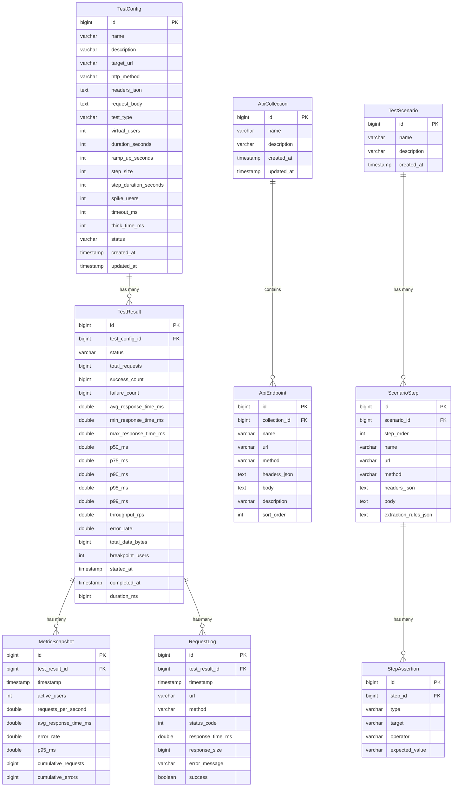

# ⚡ StormAPI — Master Implementation Roadmap

> **20 phases from zero to production deployment.**
> Designed by a Staff Engineer for maximum architecture quality, learning value, and recruiter impact.

---

## Pre-Phase: Architecture Manifesto

Before Phase 1, these non-negotiable decisions govern every phase:

| Decision | Choice | Rationale |
|---|---|---|
| **Architecture** | Feature-sliced (modular by domain) | Beats flat layered architecture for maintainability and recruiter readability |
| **Java Version** | 21 LTS | Virtual threads, pattern matching, records, sealed interfaces |
| **Spring Boot** | 3.4.x | Latest stable with virtual thread support, Micrometer observability |
| **Build Tool** | Maven with BOM | Industry standard, reproducible builds |
| **Frontend** | React 18 + TypeScript 5.x + Vite 6 | Fastest DX, type safety, modern tooling |
| **State Management** | React Context + custom hooks (no Redux) | Sufficient for this scope, less boilerplate |
| **Charts** | Recharts | React-native, composable, good for real-time |
| **WebSocket** | STOMP over SockJS | Spring's first-class support, fallback for older browsers |
| **Database** | H2 (dev) → PostgreSQL (prod) | Same JPA code, profile-switched |
| **Monorepo** | Single Git repo: `backend/` + `frontend/` | Simpler CI/CD, atomic commits across stack |
| **API Contract** | Backend drives contract, frontend consumes | No OpenAPI codegen (overkill for portfolio) |

---

# Phase 1: Project Scaffolding & Engineering Foundation

## Objective
Bootstrap the monorepo with build systems, dev tooling, editor configs, Git setup, and a verified "Hello World" for both backend and frontend. Establish the engineering foundation that every subsequent phase depends on.

## Why This Phase Comes Here
Nothing can be built without a working project skeleton. Skipping this creates cascading configuration issues in every later phase.

## Deliverables
- Spring Boot 3.4.x project with Java 21, Maven wrapper
- React + TypeScript + Vite project
- Docker Compose for development (H2 console, backend, frontend)
- Git repository with `.gitignore`, `.editorconfig`, `LICENSE`
- Backend health endpoint (`/actuator/health`)
- Frontend dev server rendering a placeholder page
- Both services communicating (frontend → backend CORS verified)

## Folder Structure Impact
```
stormapi/
├── .editorconfig
├── .gitignore
├── LICENSE
├── README.md
├── docker-compose.yml
├── docker-compose.dev.yml
│
├── backend/
│   ├── pom.xml
│   ├── mvnw / mvnw.cmd
│   ├── .mvn/wrapper/
│   ├── src/
│   │   ├── main/
│   │   │   ├── java/com/stormapi/
│   │   │   │   ├── StormApiApplication.java
│   │   │   │   └── config/
│   │   │   │       ├── CorsConfig.java
│   │   │   │       └── AsyncConfig.java
│   │   │   └── resources/
│   │   │       ├── application.yml
│   │   │       ├── application-dev.yml
│   │   │       ├── application-prod.yml
│   │   │       └── logback-spring.xml
│   │   └── test/
│   │       └── java/com/stormapi/
│   │           └── StormApiApplicationTests.java
│
├── frontend/
│   ├── package.json
│   ├── vite.config.ts
│   ├── tsconfig.json
│   ├── tsconfig.node.json
│   ├── index.html
│   ├── public/
│   │   └── favicon.svg
│   └── src/
│       ├── main.tsx
│       ├── App.tsx
│       ├── App.css
│       └── vite-env.d.ts
```

## Backend Tasks
1. Generate Spring Boot 3.4.x project with dependencies: `spring-boot-starter-web`, `spring-boot-starter-data-jpa`, `spring-boot-starter-websocket`, `spring-boot-starter-validation`, `spring-boot-starter-actuator`, `h2`, `lombok`, `spring-boot-starter-test`
2. Configure Java 21 in `pom.xml` with `<java.version>21</java.version>`
3. Enable virtual threads: `spring.threads.virtual.enabled=true` in `application.yml`
4. Create `CorsConfig.java` — allow `http://localhost:5173` in dev profile
5. Create `AsyncConfig.java` — configure async executor with virtual thread factory
6. Set up Spring profiles: `dev` (H2, debug logging), `prod` (PostgreSQL, info logging)
7. Configure `logback-spring.xml` with structured JSON logging for prod, readable format for dev
8. Verify `GET /actuator/health` returns `{"status": "UP"}`

## Frontend Tasks
1. Scaffold with `npm create vite@latest frontend -- --template react-ts`
2. Install core dependencies: `axios`, `react-router-dom`, `recharts`, `framer-motion`, `react-hook-form`, `sockjs-client`, `@stomp/stompjs`, `lucide-react`
3. Install dev dependencies: `vitest`, `@testing-library/react`, `@testing-library/jest-dom`
4. Configure Vite proxy: `/api` → `http://localhost:8080`
5. Create placeholder `App.tsx` that fetches `/actuator/health` and displays status
6. Verify CORS is working (frontend at :5173 talks to backend at :8080)

## Database Tasks
- H2 in-memory for dev with console enabled at `/h2-console`
- `spring.jpa.hibernate.ddl-auto=create-drop` for dev
- `spring.datasource.url=jdbc:h2:mem:stormapi`

## Testing Tasks
- `StormApiApplicationTests.java` — context loads test
- Frontend: verify `App.tsx` renders without crashing

## Architecture Decisions
- **Virtual threads enabled globally** — all Spring MVC request handling uses virtual threads. This is Spring Boot 3.2+ native. No manual `ExecutorService` needed for request threads.
- **Monorepo structure** — `backend/` and `frontend/` at root. Not a Maven multi-module (unnecessary complexity for 2 projects).
- **Vite proxy** — avoids CORS issues in development, simulates production reverse proxy.

## Risks
- CORS misconfiguration can block frontend→backend calls. Test early.
- H2 console path may conflict with other endpoints.

## Definition of Done
- [ ] `mvn spring-boot:run` starts backend on :8080
- [ ] `npm run dev` starts frontend on :5173
- [ ] Frontend successfully calls `/actuator/health` and displays "UP"
- [ ] `docker-compose up` runs both services
- [ ] Git repo initialized with first commit

## Primary Model
**Claude Opus 4.6**

## Why This Model Owns This Phase
Project scaffolding requires precise configuration knowledge (Maven POMs, Vite configs, Docker Compose YAML). Claude excels at getting configuration files exactly right on the first attempt.

## Collaboration Strategy
- **Claude**: Generates all configuration files (`pom.xml`, `vite.config.ts`, `docker-compose.yml`, `application.yml`)
- **Gemini**: Reviews CORS config and Docker networking for correctness
- **Cross-review**: Gemini verifies that virtual thread config is correct for Spring Boot 3.4.x

---

# Phase 2: Backend Clean Architecture & Cross-cutting Concerns

## Objective
Establish the package structure, global exception handling, structured logging, validation framework, and base classes that every backend feature will use. This is the "immune system" of the application.

## Why This Phase Comes Here
Without exception handling and validation, every subsequent controller/service will have ad-hoc error handling. Establishing patterns now prevents tech debt.

## Deliverables
- Complete package structure following feature-sliced architecture
- Global exception handler with RFC 7807 Problem Details responses
- Base entity with audit fields (`createdAt`, `updatedAt`)
- Custom validation annotations
- Request/response logging filter
- API response envelope pattern

## Folder Structure Impact
```
backend/src/main/java/com/stormapi/
├── StormApiApplication.java
├── common/                                    ← Cross-cutting concerns
│   ├── exception/
│   │   ├── GlobalExceptionHandler.java        ← @ControllerAdvice
│   │   ├── ApiException.java                  ← Base custom exception
│   │   ├── ResourceNotFoundException.java
│   │   ├── TestAlreadyRunningException.java
│   │   └── InvalidTestConfigException.java
│   ├── model/
│   │   ├── BaseEntity.java                    ← @MappedSuperclass with audit fields
│   │   └── ApiResponse.java                   ← Generic envelope: {success, data, error, timestamp}
│   ├── logging/
│   │   └── RequestLoggingFilter.java          ← Logs method, URI, status, duration
│   └── validation/
│       └── ValidUrl.java                      ← Custom @ValidUrl annotation
├── config/
│   ├── CorsConfig.java
│   ├── AsyncConfig.java
│   └── JacksonConfig.java                     ← ObjectMapper configuration
```

## Backend Tasks
1. Create `BaseEntity.java`:
   ```java
   @MappedSuperclass
   public abstract class BaseEntity {
       @Id @GeneratedValue(strategy = GenerationType.IDENTITY)
       private Long id;
       
       @CreationTimestamp
       private Instant createdAt;
       
       @UpdateTimestamp  
       private Instant updatedAt;
   }
   ```
2. Create `ApiResponse<T>` generic envelope with `success`, `data`, `error`, `timestamp`, `path` fields
3. Create `GlobalExceptionHandler` with handlers for:
   - `ResourceNotFoundException` → 404
   - `MethodArgumentNotValidException` → 400 with field errors
   - `TestAlreadyRunningException` → 409
   - `InvalidTestConfigException` → 422
   - `Exception` (catch-all) → 500
   - All return RFC 7807 `ProblemDetail` responses
4. Create `RequestLoggingFilter` — logs: `[POST /api/tests] 201 Created (45ms)`
5. Create `JacksonConfig` — configure `Instant` serialization as ISO-8601, ignore null fields
6. Create `@ValidUrl` custom constraint validator

## Frontend Tasks
- None in this phase (backend-only foundation)

## Database Tasks
- `BaseEntity` establishes the `id`, `createdAt`, `updatedAt` pattern for all future entities

## Testing Tasks
- Unit test `GlobalExceptionHandler` — verify correct HTTP status codes and response format
- Unit test `ApiResponse` serialization
- Test `@ValidUrl` validator with valid/invalid URLs

## Architecture Decisions
- **RFC 7807 Problem Details** — industry standard for error responses, not custom error objects. Spring Boot 3.x has native support via `ProblemDetail`.
- **Generic `ApiResponse<T>`** — consistent frontend parsing. Every endpoint returns `{success: true, data: T}` or `{success: false, error: {...}}`.
- **Feature-sliced packages** — NOT the traditional `controller/service/repository` flat structure. Instead: `common/`, `test/`, `metrics/`, `collection/`, `report/`. Each feature owns its vertical slice.

## Risks
- Over-engineering the response envelope. Keep it simple — don't add pagination metadata yet.
- Jackson serialization of `Instant` — defaults can produce epoch millis instead of ISO strings.

## Definition of Done
- [ ] Any unhandled exception returns structured JSON, never a stack trace
- [ ] Validation errors return field-level messages
- [ ] Request logging shows method, URI, status, and duration in console
- [ ] `BaseEntity` compiles and can be extended by future entities

## Primary Model
**Claude Opus 4.6**

## Why This Model Owns This Phase
Exception handling and cross-cutting concerns require precise Java patterns. Claude produces more robust, production-quality boilerplate with correct annotations.

## Collaboration Strategy
- **Claude**: Generates all exception classes, GlobalExceptionHandler, BaseEntity, filters
- **Gemini**: Reviews RFC 7807 compliance, suggests edge cases for exception handling
- **Cross-review**: Gemini validates that the package structure will scale to Phase 15+

---

# Phase 3: Domain Model & Database Schema

## Objective
Design and implement all JPA entities, enums, and relationships that represent the core domain: test configurations, test results, metric snapshots, request logs, and API endpoints.

## Why This Phase Comes Here
The execution engine (Phase 4+) needs entities to persist configs and results. The REST API (Phase 8) needs DTOs mapped from entities. Everything downstream depends on the data model.

## Deliverables
- 8 JPA entities with full relationships
- 5 enums
- 8 Spring Data JPA repositories with custom queries
- Database indexes for query performance
- H2 schema auto-generated and verified via H2 console

## Folder Structure Impact
```
backend/src/main/java/com/stormapi/
├── test/                                      ← Test domain
│   ├── model/
│   │   ├── TestConfig.java                    ← Test configuration entity
│   │   ├── TestResult.java                    ← Test execution result
│   │   ├── TestType.java                      ← Enum: LOAD, STRESS, SPIKE, SOAK, BREAKPOINT, SCALABILITY
│   │   ├── TestStatus.java                    ← Enum: CREATED, QUEUED, RUNNING, COMPLETED, FAILED, CANCELLED
│   │   └── HttpMethod.java                    ← Enum: GET, POST, PUT, DELETE, PATCH
│   └── repository/
│       ├── TestConfigRepository.java
│       └── TestResultRepository.java
│
├── metrics/                                   ← Metrics domain
│   ├── model/
│   │   ├── MetricSnapshot.java                ← Time-series metric point
│   │   └── RequestLog.java                    ← Individual request log entry
│   └── repository/
│       ├── MetricSnapshotRepository.java
│       └── RequestLogRepository.java
│
├── collection/                                ← API collections domain
│   ├── model/
│   │   ├── ApiCollection.java                 ← Folder/group of endpoints
│   │   ├── ApiEndpoint.java                   ← Saved API endpoint
│   │   └── KeyValuePair.java                  ← Embeddable for headers/params
│   └── repository/
│       ├── ApiCollectionRepository.java
│       └── ApiEndpointRepository.java
│
├── scenario/                                  ← Test scenario domain
│   ├── model/
│   │   ├── TestScenario.java                  ← Multi-step test scenario
│   │   ├── ScenarioStep.java                  ← Individual step in scenario
│   │   └── Assertion.java                     ← Step-level assertion
│   └── repository/
│       ├── TestScenarioRepository.java
│       └── ScenarioStepRepository.java
```

## Backend Tasks
1. **`TestConfig.java`** — the master configuration entity:
   ```
   Fields: name, description, targetUrl, httpMethod, headers (JSON), 
           requestBody, testType, virtualUsers, durationSeconds, 
           rampUpSeconds, stepSize, stepDurationSeconds, spikeUsers,
           maxRetries, timeoutMs, thinkTimeMs, status
   ```
2. **`TestResult.java`** — execution result:
   ```
   Fields: testConfigId (FK), status, totalRequests, successCount, 
           failureCount, avgResponseTimeMs, minResponseTimeMs, 
           maxResponseTimeMs, p50Ms, p75Ms, p90Ms, p95Ms, p99Ms,
           throughputRps, errorRate, totalDataBytes, 
           startedAt, completedAt, durationMs, breakpointUsers (nullable)
   ```
3. **`MetricSnapshot.java`** — time-series data point (1 per second during test):
   ```
   Fields: testResultId (FK), timestamp, activeUsers, requestsPerSecond,
           avgResponseTimeMs, errorRate, p95Ms, cumulativeRequests,
           cumulativeErrors
   ```
4. **`RequestLog.java`** — individual request record:
   ```
   Fields: testResultId (FK), timestamp, url, method, statusCode,
           responseTimeMs, responseSize, errorMessage (nullable), success
   ```
5. **`ApiEndpoint.java`**:
   ```
   Fields: collectionId (FK), name, url, method, headers, body, 
           description, sortOrder
   ```
6. **`TestScenario.java`** + **`ScenarioStep.java`** + **`Assertion.java`**
7. Create repositories with custom queries:
   - `TestResultRepository.findByTestConfigIdOrderByCreatedAtDesc()`
   - `MetricSnapshotRepository.findByTestResultIdOrderByTimestamp()`
   - `RequestLogRepository.countByTestResultIdAndSuccess(Long id, boolean success)`
   - `TestConfigRepository.findByStatusIn(List<TestStatus>)`
8. Add indexes: `@Index` on `MetricSnapshot.testResultId + timestamp`, `RequestLog.testResultId`

## Frontend Tasks
- Create TypeScript type definitions matching all entities in `src/types/`

## Database Tasks
- Entity relationships:
  - `TestConfig` 1:N `TestResult`
  - `TestResult` 1:N `MetricSnapshot`
  - `TestResult` 1:N `RequestLog`
  - `ApiCollection` 1:N `ApiEndpoint`
  - `TestScenario` 1:N `ScenarioStep`
  - `ScenarioStep` 1:N `Assertion`
- `KeyValuePair` as `@Embeddable` + `@ElementCollection` for headers
- Verify schema via H2 console (`/h2-console`)

## Testing Tasks
- Repository integration tests using `@DataJpaTest`
- Verify cascade operations (delete `TestResult` cascades to `MetricSnapshot`, `RequestLog`)
- Verify custom query methods return correct data

## Architecture Decisions
- **`Instant` for all timestamps** — never `LocalDateTime`. `Instant` is timezone-agnostic and correct for distributed systems.
- **JSON column for headers** — using `@Convert` with a `MapToJsonConverter` rather than separate header table. Simpler and sufficient.
- **Separate `TestConfig` and `TestResult`** — a config can be re-run multiple times, producing multiple results. This is a critical domain insight most beginners miss.
- **`MetricSnapshot` per second** — 1 row per second during test. A 5-minute test = 300 rows. Manageable even for H2.

## Risks
- Over-normalizing the schema. Headers as JSON is intentional.
- `RequestLog` can grow very large (10,000+ rows per test). Need pagination on queries and batch inserts.
- Missing indexes will cause slow dashboard queries later.

## Definition of Done
- [ ] All 8 entities compile and JPA auto-generates tables
- [ ] H2 console shows all tables with correct columns and relationships
- [ ] Repository tests pass for custom queries
- [ ] TypeScript types match entity structure
- [ ] Cascade delete works correctly

## Primary Model
**Claude Opus 4.6**

## Why This Model Owns This Phase
Data modeling requires careful thought about relationships, nullable fields, and JPA annotations. Claude is more precise with Hibernate/JPA annotation placement and cascade behavior.

## Collaboration Strategy
- **Claude**: Generates all entity classes, repositories, and type converters
- **Gemini**: Reviews schema design for query performance, suggests missing indexes
- **Cross-review**: Gemini verifies the time-series data model (MetricSnapshot) will work for chart rendering

---

# Phase 4: Core HTTP Execution Engine

## Objective
Build the foundational HTTP request execution engine — the async machinery that sends HTTP requests, measures latency, and returns structured results. This is the heart of StormAPI.

## Why This Phase Comes Here
Every test type (Load, Stress, Spike, etc.) needs the ability to send HTTP requests and measure response time. The engine must exist before any test type can be implemented.

## Deliverables
- `HttpRequestExecutor` — async HTTP request sender with precise timing
- `VirtualUserSimulator` — simulates one user's request loop
- `ExecutionContext` — shared context for a test run (metrics, config, state)
- Request/response recording models
- Connection pool and timeout configuration

## Folder Structure Impact
```
backend/src/main/java/com/stormapi/
├── engine/                                    ← ⭐ Core execution engine
│   ├── http/
│   │   ├── HttpRequestExecutor.java           ← Sends one HTTP request, returns timing data
│   │   ├── RequestSpec.java                   ← Immutable request specification (URL, method, headers, body)
│   │   ├── RequestResult.java                 ← Record: statusCode, responseTimeNanos, bodySize, error
│   │   └── HttpClientFactory.java             ← Creates configured HttpClient instances
│   ├── user/
│   │   ├── VirtualUserSimulator.java          ← Runs one virtual user's request loop
│   │   └── ThinkTimeStrategy.java             ← Interface: constant, random, none
│   └── context/
│       └── ExecutionContext.java               ← Shared state: config, metrics ref, running flag
```

## Backend Tasks
1. **`HttpClientFactory.java`** — creates `java.net.http.HttpClient` with:
   - Configurable connection timeout
   - HTTP/2 support
   - Redirect policy (NEVER — we want to see 3xx)
   - Custom executor (virtual thread executor)
2. **`RequestSpec.java`** (record):
   ```java
   public record RequestSpec(
       String url,
       String method,
       Map<String, String> headers,
       String body,
       Duration timeout
   ) {}
   ```
3. **`RequestResult.java`** (record):
   ```java
   public record RequestResult(
       int statusCode,
       long responseTimeNanos,
       long responseBodySize,
       boolean success,
       String errorMessage,
       Instant timestamp
   ) {}
   ```
4. **`HttpRequestExecutor.java`**:
   - `CompletableFuture<RequestResult> executeAsync(RequestSpec spec)` — sends request, measures `System.nanoTime()` for precise timing
   - Handles timeouts, connection refused, DNS failures → returns `RequestResult` with error info, never throws
   - Uses `HttpClient.sendAsync()` for non-blocking I/O
5. **`VirtualUserSimulator.java`**:
   - `void run(ExecutionContext ctx)` — loops: send request → record result → think time → repeat until `ctx.isRunning() == false`
   - Each virtual user runs on its own virtual thread
   - Reports each `RequestResult` to the `ExecutionContext`'s metrics collector
6. **`ThinkTimeStrategy`** — interface with implementations: `NoThinkTime`, `ConstantThinkTime`, `RandomThinkTime(min, max)`
7. **`ExecutionContext.java`** — holds: `RequestSpec`, test config, `AtomicBoolean running`, reference to metrics collector (added in Phase 5)

## Frontend Tasks
- None in this phase

## Database Tasks
- None in this phase (engine is in-memory)

## Testing Tasks
- **Unit test `HttpRequestExecutor`** — mock a local HTTP server (use WireMock or a simple `HttpServer`), verify:
  - Successful request returns correct status code and timing
  - Timeout returns error result (not exception)
  - Connection refused returns error result
- **Unit test `VirtualUserSimulator`** — verify it sends N requests and stops when context is stopped
- **Unit test `ThinkTimeStrategy`** — verify random think time is within bounds
- **Benchmark**: Send 1000 requests to a local mock server, verify throughput

## Architecture Decisions
- **`System.nanoTime()` for latency** — NOT `System.currentTimeMillis()`. Nanotime is monotonic and precise, millis can jump due to NTP adjustments. This is what JMeter and Gatling use.
- **Records for data objects** — `RequestSpec` and `RequestResult` are immutable records. No setters, no Lombok needed. Modern Java 21 practice.
- **Errors as values** — `HttpRequestExecutor` NEVER throws exceptions. Errors are returned as `RequestResult(success=false, errorMessage=...)`. This prevents virtual user threads from crashing.
- **Virtual threads for virtual users** — each simulated user runs on its own virtual thread. Java 21 can handle 100,000+ virtual threads. No `ExecutorService` with fixed thread pools needed for user simulation.

## Risks
- `HttpClient` connection pool exhaustion under high load. Configure `HttpClient` per test run, not globally.
- DNS resolution caching can mask issues. Disable JVM DNS cache for accuracy.
- Virtual threads + `synchronized` blocks can cause pinning. Use `ReentrantLock` instead.

## Definition of Done
- [ ] `HttpRequestExecutor` can send GET/POST/PUT/DELETE requests
- [ ] Latency measurement is accurate (within 1ms of actual)
- [ ] Timeout handling works without throwing exceptions
- [ ] `VirtualUserSimulator` runs on a virtual thread and loops correctly
- [ ] Unit tests pass with mock HTTP server

## Primary Model
**Claude Opus 4.6**

## Why This Model Owns This Phase
The HTTP engine is performance-critical, thread-safety-critical code. Claude produces more robust concurrent code with correct `nanoTime()` usage and virtual thread patterns.

## Collaboration Strategy
- **Claude**: Generates `HttpRequestExecutor`, `VirtualUserSimulator`, all records
- **Gemini**: Reviews thread-safety, virtual thread pinning risks, and connection pool config
- **Cross-review**: Gemini stress-tests the engine design for 10,000+ concurrent users

---

# Phase 5: Metrics Collection Engine

## Objective
Build the thread-safe, high-performance metrics collection system that aggregates request results in real-time using HdrHistogram for accurate percentile calculation and `LongAdder` for lock-free counting.

## Why This Phase Comes Here
The HTTP engine (Phase 4) produces raw `RequestResult` objects. The metrics engine aggregates them into meaningful statistics. Test engines (Phase 6) will orchestrate both.

## Deliverables
- `MetricsCollector` — thread-safe aggregator using HdrHistogram + LongAdder
- `MetricsSnapshot` — immutable snapshot of current metrics (for WebSocket broadcasting)
- `StatusCodeTracker` — tracks distribution of HTTP status codes
- Time-window based sampling for time-series data

## Folder Structure Impact
```
backend/src/main/java/com/stormapi/
├── engine/
│   ├── metrics/
│   │   ├── MetricsCollector.java              ← Thread-safe aggregation engine
│   │   ├── LiveMetricsSnapshot.java           ← Immutable snapshot (record)
│   │   ├── StatusCodeTracker.java             ← ConcurrentHashMap<Integer, LongAdder>
│   │   ├── ThroughputTracker.java             ← Sliding-window RPS calculation
│   │   └── PercentileCalculator.java          ← HdrHistogram wrapper
```

## Backend Tasks
1. Add HdrHistogram dependency to `pom.xml`: `org.hdrhistogram:HdrHistogram:2.2.2`
2. **`MetricsCollector.java`**:
   ```java
   public class MetricsCollector {
       private final LongAdder totalRequests = new LongAdder();
       private final LongAdder successCount = new LongAdder();
       private final LongAdder failureCount = new LongAdder();
       private final LongAdder totalBytes = new LongAdder();
       private final Histogram latencyHistogram; // HdrHistogram
       private final StatusCodeTracker statusCodes;
       private final ThroughputTracker throughput;
       private final AtomicInteger activeUsers = new AtomicInteger(0);
       
       public void recordResult(RequestResult result) { ... }
       public LiveMetricsSnapshot snapshot() { ... }
       public void reset() { ... }
   }
   ```
3. **`LiveMetricsSnapshot.java`** (record):
   ```java
   public record LiveMetricsSnapshot(
       long totalRequests,
       long successCount,
       long failureCount,
       double avgResponseTimeMs,
       double minResponseTimeMs,
       double maxResponseTimeMs,
       double p50Ms, double p75Ms, double p90Ms, double p95Ms, double p99Ms,
       double throughputRps,
       double errorRate,
       int activeUsers,
       long totalDataBytes,
       Map<Integer, Long> statusCodeDistribution,
       Instant timestamp
   ) {}
   ```
4. **`ThroughputTracker.java`** — sliding window (1-second buckets) for accurate RPS
5. **`PercentileCalculator.java`** — wraps HdrHistogram, records latencies in microseconds, outputs millisecond percentiles
6. **`StatusCodeTracker.java`** — `ConcurrentHashMap<Integer, LongAdder>` for lock-free counting
7. Wire `MetricsCollector` into `ExecutionContext` from Phase 4 — `VirtualUserSimulator` calls `metricsCollector.recordResult(result)` after each request

## Frontend Tasks
- None in this phase

## Database Tasks
- None in this phase (in-memory metrics, persisted in Phase 6)

## Testing Tasks
- **Concurrency test**: 100 threads recording results simultaneously → verify counts are correct (no lost updates)
- **Percentile accuracy test**: Record known latencies, verify P50/P95/P99 are correct
- **Throughput test**: Record 1000 results in 1 second, verify throughputRps ≈ 1000
- **Snapshot isolation**: Verify `snapshot()` returns a consistent point-in-time view

## Architecture Decisions
- **HdrHistogram over manual percentile calculation** — HdrHistogram is the industry standard (used by JMeter, Gatling, Prometheus). It handles billions of values with fixed memory (~40KB) and O(1) percentile queries.
- **`LongAdder` over `AtomicLong`** — `LongAdder` is designed for high-contention write scenarios. With 1000+ virtual users, `AtomicLong.incrementAndGet()` creates CAS contention. `LongAdder` distributes across striped cells.
- **Sliding-window throughput** — NOT `totalRequests / elapsedSeconds`. That gives the overall average. We want *current* throughput — requests in the last 1-second window.

## Risks
- HdrHistogram requires upfront range configuration (`1μs to 30s`). If a request takes longer than max, it clips.
- `LongAdder.sum()` is eventually consistent, not linearizable. Acceptable for metrics.
- Memory: Each `MetricsCollector` uses ~100KB. Fine for single test runs.

## Definition of Done
- [ ] 100 concurrent threads can record results without data loss
- [ ] Percentiles match expected values from known input
- [ ] `snapshot()` returns complete, consistent data
- [ ] ThroughputTracker reports accurate per-second RPS
- [ ] Integration with VirtualUserSimulator verified

## Primary Model
**Claude Opus 4.6**

## Why This Model Owns This Phase
Thread-safe concurrent data structures and HdrHistogram integration require precise Java concurrency knowledge. Claude handles `LongAdder`, `ConcurrentHashMap`, and histogram configuration more accurately.

## Collaboration Strategy
- **Claude**: Generates `MetricsCollector`, `PercentileCalculator`, concurrency tests
- **Gemini**: Reviews thread-safety guarantees, suggests edge cases
- **Cross-review**: Gemini validates HdrHistogram range config and memory characteristics

---

# Phase 6: Load Test Engine & Test Orchestration

## Objective
Implement the first test type (Load Testing) and the orchestration layer that manages the full lifecycle: create → validate → execute → collect → persist → complete.

## Why This Phase Comes Here
HTTP engine (Phase 4) sends requests. Metrics engine (Phase 5) collects stats. Now we compose them into a complete test execution flow with the Load Test as the first concrete implementation.

## Deliverables
- `TestEngine` interface — contract for all test types
- `AbstractTestEngine` — template method with shared lifecycle
- `LoadTestEngine` — complete Load Test implementation
- `TestOrchestrator` — service that manages test lifecycle
- `TestEngineFactory` — creates correct engine for test type
- `RampUpStrategy` — linear/instant/step ramp-up
- Persistence of results after test completion

## Folder Structure Impact
```
backend/src/main/java/com/stormapi/
├── engine/
│   ├── TestEngine.java                        ← Interface
│   ├── AbstractTestEngine.java                ← Template method base
│   ├── TestEngineFactory.java                 ← Factory for engine creation
│   ├── load/
│   │   └── LoadTestEngine.java                ← Load test implementation
│   ├── ramp/
│   │   ├── RampUpStrategy.java                ← Interface
│   │   ├── LinearRampUp.java
│   │   ├── InstantRampUp.java
│   │   └── StepRampUp.java
│   ├── http/ (from Phase 4)
│   ├── metrics/ (from Phase 5)
│   ├── user/ (from Phase 4)
│   └── context/
│       └── ExecutionContext.java               ← Updated with lifecycle hooks
│
├── test/
│   ├── service/
│   │   └── TestOrchestrator.java              ← Test lifecycle management
│   ├── model/ (from Phase 3)
│   └── repository/ (from Phase 3)
```

## Backend Tasks
1. **`TestEngine.java`** interface:
   ```java
   public interface TestEngine {
       TestType getType();
       void execute(ExecutionContext context) throws InterruptedException;
       void stop();
   }
   ```
2. **`AbstractTestEngine.java`** — template method:
   ```java
   public abstract class AbstractTestEngine implements TestEngine {
       // Template method
       public final void run(ExecutionContext ctx) {
           onBeforeTest(ctx);
           execute(ctx);
           onAfterTest(ctx);
       }
       protected void onBeforeTest(ExecutionContext ctx) { /* metrics reset */ }
       protected abstract void execute(ExecutionContext ctx);
       protected void onAfterTest(ExecutionContext ctx) { /* final snapshot */ }
   }
   ```
3. **`LoadTestEngine.java`**:
   - Accepts: `virtualUsers`, `durationSeconds`, `rampUpSeconds`
   - Ramps up virtual users using `RampUpStrategy`
   - Each virtual user runs `VirtualUserSimulator` on a virtual thread
   - Runs for `durationSeconds`, then signals stop
   - Collects final metrics snapshot
4. **`RampUpStrategy`** implementations:
   - `LinearRampUp` — adds users evenly over ramp-up period
   - `InstantRampUp` — all users start at once
   - `StepRampUp` — adds batch of users every N seconds
5. **`TestOrchestrator.java`** — the lifecycle manager:
   ```java
   @Service
   public class TestOrchestrator {
       public TestResult startTest(TestConfig config) {
           // 1. Validate config
           // 2. Set status = RUNNING
           // 3. Create ExecutionContext
           // 4. Get TestEngine from factory
           // 5. Execute asynchronously on virtual thread
           // 6. On completion: persist TestResult + MetricSnapshots
           // 7. Set status = COMPLETED or FAILED
           return result;
       }
       public void stopTest(Long testId) { ... }
   }
   ```
6. **`TestEngineFactory.java`** — `create(TestType type)` returns correct engine
7. Wire periodic `MetricSnapshot` persistence — every 1 second during test, persist a snapshot to DB for time-series charts

## Frontend Tasks
- None in this phase

## Database Tasks
- `TestResult` populated with final aggregated metrics
- `MetricSnapshot` rows inserted every second during test execution
- Batch insert for `RequestLog` entries (every 100 records)

## Testing Tasks
- **Integration test**: Run a LoadTest against a mock server → verify `TestResult` is persisted with correct metrics
- **Unit test**: `LinearRampUp` adds correct number of users at each interval
- **Unit test**: `LoadTestEngine` runs for specified duration and stops
- **Unit test**: `TestOrchestrator` transitions status correctly: CREATED → RUNNING → COMPLETED

## Architecture Decisions
- **Template Method pattern** — `AbstractTestEngine.run()` handles before/after hooks. Subclasses only implement `execute()`. Guarantees cleanup runs even if execution fails.
- **Strategy pattern for ramp-up** — different ramp-up behaviors are interchangeable without modifying the engine.
- **Async execution via virtual threads** — `TestOrchestrator` launches the test on a virtual thread (`Thread.startVirtualThread()`), not a `CompletableFuture`. Simpler, and the test engine manages its own lifecycle.
- **Periodic metric persistence** — a `ScheduledExecutorService` snapshots metrics every second. These time-series points power the post-test timeline chart.

## Risks
- If the test target is unreachable, the test hangs until timeout on every request. Need aggressive timeout defaults (5s).
- Batch inserting `RequestLog` can bottleneck. Use `@Async` repository save with `saveAll()` in batches.
- Virtual thread count for large tests (10,000 users) — monitor with `ThreadMXBean`.

## Definition of Done
- [ ] Load test executes against mock server with correct user count and duration
- [ ] Metrics are accurate (compared to manual calculation)
- [ ] `TestResult` persisted to DB with all percentile values
- [ ] `MetricSnapshot` time-series data appears in DB (1 row per second)
- [ ] Test can be stopped mid-execution via `stopTest()`
- [ ] Status transitions: CREATED → RUNNING → COMPLETED/FAILED

## Primary Model
**Claude Opus 4.6**

## Why This Model Owns This Phase
The orchestrator and template method pattern require careful lifecycle management. Claude produces more robust concurrent lifecycle code with correct cleanup semantics.

## Collaboration Strategy
- **Claude**: Generates `AbstractTestEngine`, `LoadTestEngine`, `TestOrchestrator`, `RampUpStrategy`
- **Gemini**: Reviews lifecycle edge cases (what if test fails mid-ramp-up? what if DB write fails?)
- **Cross-review**: Gemini validates that the template method won't leak threads on failure

---

# Phase 7: Advanced Test Engines (Stress, Spike, Soak, Breakpoint, Scalability)

## Objective
Implement the remaining 5 test types, each with unique load patterns and specialized analysis.

## Why This Phase Comes Here
The `AbstractTestEngine`, `VirtualUserSimulator`, and `MetricsCollector` infrastructure from Phases 4–6 are ready. Each new test type is a Strategy implementation — fast to add.

## Deliverables
- `StressTestEngine` — stepwise load increase
- `SpikeTestEngine` — sudden traffic burst
- `SoakTestEngine` — long-duration steady load with trend detection
- `BreakpointTestEngine` — finds exact breaking point
- `ScalabilityTestEngine` — measures throughput at each user step

## Folder Structure Impact
```
backend/src/main/java/com/stormapi/engine/
├── stress/
│   └── StressTestEngine.java
├── spike/
│   └── SpikeTestEngine.java
├── soak/
│   ├── SoakTestEngine.java
│   └── TrendAnalyzer.java                    ← Linear regression for degradation detection
├── breakpoint/
│   └── BreakpointTestEngine.java
├── scalability/
│   └── ScalabilityTestEngine.java
```

## Backend Tasks
1. **`StressTestEngine`**: Start at `startUsers`, add `stepSize` every `stepDurationSeconds`. Stop at `maxUsers` or when error rate exceeds 50%. Record which step degradation began.
2. **`SpikeTestEngine`**: Run `baseUsers` for warm-up (30s) → instantly jump to `spikeUsers` for `spikeDuration` → drop back to `baseUsers` → observe recovery for `recoverySeconds`. Record recovery time.
3. **`SoakTestEngine`**: Steady `virtualUsers` for long duration (configurable, e.g., 10-30 minutes). Periodically sample metrics. After test, run `TrendAnalyzer` — simple linear regression on response times. Report: is latency increasing over time? (indicates memory leak).
4. **`BreakpointTestEngine`**: Binary-search approach — start at `startUsers`, double until errors spike, then bisect to find exact threshold. More efficient than linear stress test. Reports `breakpointUsers`.
5. **`ScalabilityTestEngine`**: Execute at predefined user steps (e.g., [10, 50, 100, 200, 500]). Run each step for `stepDurationSeconds`. Collect throughput per step. Generate scalability curve data.
6. Update `TestEngineFactory` to create all 6 engine types

## Frontend Tasks
- None in this phase

## Database Tasks
- `TestResult.breakpointUsers` field used by BreakpointTestEngine
- `TestResult` type-specific fields are nullable (scalability curve data stored in MetricSnapshots)

## Testing Tasks
- **StressTestEngine**: Verify user count increases at correct intervals
- **SpikeTestEngine**: Verify spike timing (ramp → spike → recovery phases)
- **SoakTestEngine**: Feed artificially degrading latencies → verify TrendAnalyzer detects it
- **BreakpointTestEngine**: Verify binary search converges to correct breakpoint
- **ScalabilityTestEngine**: Verify metrics are collected per step

## Architecture Decisions
- **`TrendAnalyzer` uses simple linear regression** — `slope > threshold` indicates degradation. No ML library needed — just `Σ(xy) - n*x̄*ȳ / Σ(x²) - n*x̄²`. Elegant and recruiter-impressive.
- **Binary search for breakpoint** — O(log n) vs O(n) for stress test. Shows algorithmic thinking.

## Risks
- Soak tests run long. Need test timeouts and cancellation support.
- Breakpoint binary search may oscillate if the API has inconsistent behavior.

## Definition of Done
- [ ] All 6 test types execute correctly against mock server
- [ ] Each test type produces specialized data (breakpoint count, scalability curve, recovery time)
- [ ] `TestEngineFactory.create()` returns correct engine for all `TestType` enum values
- [ ] Status transitions work for all types

## Primary Model
**Gemini 3.1 Pro**

## Why This Model Owns This Phase
Each engine is a self-contained Strategy implementation following the pattern established in Phase 6. Gemini excels at generating multiple variations of a known pattern efficiently.

## Collaboration Strategy
- **Gemini**: Generates all 5 engine classes + TrendAnalyzer
- **Claude**: Reviews algorithmic correctness (binary search for breakpoint, linear regression for soak)
- **Cross-review**: Claude validates thread-safety of dynamic user scaling in StressTestEngine

---

# Phase 8: REST API Layer (Controllers, DTOs, Validation)

## Objective
Expose all backend functionality through a clean, validated, documented REST API.

## Why This Phase Comes Here
The test engines and persistence layer are complete. The REST API is the bridge to the frontend. Every subsequent frontend phase calls these endpoints.

## Deliverables
- 5 REST controllers with full CRUD + actions
- Request/Response DTOs with Jakarta Validation
- DTO ↔ Entity mappers
- Paginated list endpoints
- API response standardization

## Folder Structure Impact
```
backend/src/main/java/com/stormapi/
├── test/
│   ├── controller/
│   │   └── TestController.java                ← POST/GET/DELETE tests, POST stop
│   ├── dto/
│   │   ├── CreateTestRequest.java
│   │   ├── TestConfigResponse.java
│   │   ├── TestResultResponse.java
│   │   └── TestSummaryResponse.java           ← Lightweight for list views
│   ├── mapper/
│   │   └── TestMapper.java                    ← Entity ↔ DTO conversion
│   └── service/
│       ├── TestOrchestrator.java (from Phase 6)
│       └── TestQueryService.java              ← Read-only queries for results
│
├── metrics/
│   ├── controller/
│   │   └── MetricsController.java             ← GET time-series, GET request logs
│   └── dto/
│       ├── MetricSnapshotResponse.java
│       └── RequestLogResponse.java
│
├── collection/
│   ├── controller/
│   │   └── CollectionController.java          ← CRUD for collections + endpoints
│   └── dto/
│       ├── CreateCollectionRequest.java
│       ├── CreateEndpointRequest.java
│       ├── CollectionResponse.java
│       └── EndpointResponse.java
│
├── dashboard/
│   ├── controller/
│   │   └── DashboardController.java           ← GET /api/dashboard/stats
│   ├── dto/
│   │   └── DashboardStatsResponse.java
│   └── service/
│       └── DashboardService.java
│
├── export/
│   ├── controller/
│   │   └── ExportController.java              ← GET /api/export/{id}/json, /csv
│   └── service/
│       └── ExportService.java
```

## Backend Tasks
1. **`TestController.java`**:
   - `POST /api/tests` — create and start test (validates `CreateTestRequest`)
   - `GET /api/tests` — list all tests (paginated, filterable by status/type)
   - `GET /api/tests/{id}` — get test config
   - `GET /api/tests/{id}/result` — get latest result
   - `GET /api/tests/{id}/results` — get all results (re-runs)
   - `POST /api/tests/{id}/stop` — stop running test
   - `POST /api/tests/{id}/rerun` — re-run with same config
   - `DELETE /api/tests/{id}` — delete test and all results
2. **`CreateTestRequest.java`** with validation:
   ```java
   public record CreateTestRequest(
       @NotBlank String name,
       @ValidUrl @NotBlank String targetUrl,
       @NotNull HttpMethod httpMethod,
       Map<String, String> headers,
       String requestBody,
       @NotNull TestType testType,
       @Min(1) @Max(10000) int virtualUsers,
       @Min(1) @Max(3600) int durationSeconds,
       @Min(0) int rampUpSeconds,
       // ... type-specific fields
   ) {}
   ```
3. **`DashboardController.java`**:
   - `GET /api/dashboard/stats` — returns: totalTests, totalRequests, avgResponseTime, avgThroughput, recentTests
4. **`ExportController.java`**:
   - `GET /api/export/{testId}/json` — full result as JSON download
   - `GET /api/export/{testId}/csv` — metrics as CSV download
5. **`TestMapper.java`** — manual mapping (no MapStruct, shows you understand the pattern):
   ```java
   public class TestMapper {
       public static TestConfig toEntity(CreateTestRequest request) { ... }
       public static TestConfigResponse toResponse(TestConfig entity) { ... }
       public static TestResultResponse toResultResponse(TestResult result) { ... }
   }
   ```
6. All controllers use `ApiResponse<T>` envelope from Phase 2

## Frontend Tasks
- Create `src/api/` layer with Axios client and typed API functions (preparation for Phase 10)

## Database Tasks
- None new (using existing repositories)

## Testing Tasks
- **`@WebMvcTest` for each controller** — test with MockMvc:
  - Valid request → 200/201
  - Invalid request → 400 with field errors
  - Non-existent ID → 404
  - Stop non-running test → 409
- **Service layer unit tests** with mocked repositories

## Architecture Decisions
- **Manual DTO mapping** — MapStruct is powerful but adds complexity. Manual mapping in a `Mapper` class is more readable and shows the developer understands the pattern, which is more impressive on a portfolio.
- **Separate `TestQueryService`** — read-only service for queries (CQRS-lite). Keeps `TestOrchestrator` focused on writes/commands.
- **Paginated endpoints use `Pageable`** — Spring's built-in pagination. Frontend passes `?page=0&size=20&sort=createdAt,desc`.

## Risks
- DTO explosion — too many DTOs can clutter the codebase. Use `record` to keep them concise.
- Forgetting to validate nullable type-specific fields (e.g., `spikeUsers` is required only for SPIKE test type).

## Definition of Done
- [ ] All endpoints return correct status codes and `ApiResponse<T>` envelope
- [ ] Validation errors return field-level messages
- [ ] Pagination works on list endpoints
- [ ] Controller tests pass for happy path + error cases
- [ ] Export endpoints return downloadable files with correct MIME types

## Primary Model
**Gemini 3.1 Pro**

## Why This Model Owns This Phase
REST controller generation is pattern-heavy — many endpoints following the same structure. Gemini generates repetitive but consistent code efficiently.

## Collaboration Strategy
- **Gemini**: Generates all controllers, DTOs, and mapper
- **Claude**: Reviews validation annotations, edge cases, and error handling
- **Cross-review**: Claude validates pagination and export implementation

---

# Phase 9: WebSocket Real-time Streaming

## Objective
Implement STOMP over WebSocket for real-time metrics streaming during test execution. The frontend will receive live updates every second.

## Why This Phase Comes Here
The REST API is complete (Phase 8), but live test monitoring requires push-based communication. WebSocket infrastructure must exist before the Live Monitor UI page (Phase 13).

## Deliverables
- WebSocket STOMP configuration
- `LiveMetricsBroadcaster` service
- Per-test topic subscriptions (`/topic/metrics/{testId}`)
- Live request log streaming
- Test lifecycle event streaming (started, completed, failed)

## Folder Structure Impact
```
backend/src/main/java/com/stormapi/
├── websocket/
│   ├── WebSocketConfig.java                   ← STOMP endpoint + message broker config
│   ├── LiveMetricsBroadcaster.java            ← Broadcasts snapshots every second
│   └── TestEventPublisher.java                ← Publishes lifecycle events
```

## Backend Tasks
1. **`WebSocketConfig.java`**:
   ```java
   @Configuration
   @EnableWebSocketMessageBroker
   public class WebSocketConfig implements WebSocketMessageBrokerConfigurer {
       @Override
       public void configureMessageBroker(MessageBrokerRegistry config) {
           config.enableSimpleBroker("/topic");
           config.setApplicationDestinationPrefixes("/app");
       }
       @Override
       public void registerStompEndpoints(StompEndpointRegistry registry) {
           registry.addEndpoint("/ws").setAllowedOriginPatterns("*").withSockJS();
       }
   }
   ```
2. **`LiveMetricsBroadcaster.java`**:
   - During test execution, a scheduled task takes a `MetricsCollector.snapshot()` every second
   - Broadcasts to `/topic/metrics/{testId}` using `SimpMessagingTemplate`
   - Also broadcasts to `/topic/logs/{testId}` — last N request logs
3. **`TestEventPublisher.java`**:
   - Broadcasts lifecycle events to `/topic/events/{testId}`: `TEST_STARTED`, `TEST_COMPLETED`, `TEST_FAILED`, `TEST_CANCELLED`
   - Frontend uses these to update UI state
4. Wire broadcaster into `TestOrchestrator` — start broadcasting when test starts, stop when test ends
5. Handle multiple concurrent tests — each test has its own broadcast channel

## Frontend Tasks
- Create `src/hooks/useWebSocket.ts` — reusable hook for STOMP connection:
  ```typescript
  function useWebSocket(testId: string) {
      const [metrics, setMetrics] = useState<LiveMetrics | null>(null);
      const [events, setEvents] = useState<TestEvent[]>([]);
      // Connect to /ws, subscribe to /topic/metrics/{testId}
      // Return: { metrics, events, connected, disconnect }
  }
  ```
- Install `@stomp/stompjs` and `sockjs-client`

## Database Tasks
- None (WebSocket is real-time, not persisted — metrics are already persisted by Phase 6)

## Testing Tasks
- **Integration test**: Start test → subscribe to WebSocket → verify metrics arrive every ~1 second
- **Test disconnection**: Client disconnects and reconnects → verify no errors
- **Test multiple subscribers**: Two clients subscribe to same test → both receive metrics

## Architecture Decisions
- **STOMP over SockJS** — STOMP provides topics/subscriptions (pub-sub). SockJS provides WebSocket fallback for browsers that don't support it. This is Spring Boot's recommended approach.
- **Simple broker** — not RabbitMQ/Kafka. The simple in-memory broker is sufficient for this project's scale.
- **Per-test topics** — `/topic/metrics/{testId}` isolates streams. Multiple tests can run simultaneously without cross-talk.

## Risks
- WebSocket memory leak if clients don't disconnect properly. Implement session tracking and cleanup.
- Broadcast every second for 10-minute test = 600 messages. Fine for in-memory broker.
- Frontend reconnection logic needs robustness (network blips).

## Definition of Done
- [ ] WebSocket endpoint accessible at `/ws`
- [ ] Frontend hook connects and receives live metrics
- [ ] Metrics arrive every ~1 second during test
- [ ] Lifecycle events (started/completed/failed) received
- [ ] Multiple clients can subscribe to same test
- [ ] Clean disconnection on test completion

## Primary Model
**Claude Opus 4.6**

## Why This Model Owns This Phase
WebSocket + STOMP configuration in Spring Boot requires precise annotation placement and message broker configuration. Claude handles the Spring WebSocket API nuances more accurately.

## Collaboration Strategy
- **Claude**: Generates WebSocket config, broadcaster, and React hook
- **Gemini**: Reviews reconnection logic and edge cases (what if backend restarts mid-test?)
- **Cross-review**: Gemini tests the frontend hook for memory leaks (stale closures)

---

# Phase 10: Frontend Design System & Application Shell

## Objective
Build the visual foundation: CSS design system with dark/light themes, layout components (sidebar, header), routing, and all reusable UI components. The application should look stunning with zero feature pages — just the chrome.

## Why This Phase Comes Here
The backend is feature-complete. Starting frontend development requires the design system and layout to be established first, so all subsequent pages are visually consistent.

## Deliverables
- CSS design system (custom properties, dark mode, typography, spacing)
- Application layout (sidebar + header + content area)
- 15+ reusable components
- React Router with all route definitions
- Theme toggle (dark/light)
- Google Fonts integration (Inter)

## Folder Structure Impact
```
frontend/src/
├── index.css                                  ← CSS reset, variables, dark mode, typography
├── App.tsx                                    ← Router + Layout wrapper
├── components/
│   ├── layout/
│   │   ├── Layout.tsx                         ← Sidebar + Header + main content
│   │   ├── Sidebar.tsx                        ← Left nav with icons + labels
│   │   ├── Header.tsx                         ← Top bar: breadcrumb, search, theme toggle
│   │   └── Layout.module.css
│   ├── common/
│   │   ├── KpiCard.tsx                        ← Metric card with icon, value, label, trend
│   │   ├── StatusBadge.tsx                    ← Color-coded pill (Running, Passed, Failed)
│   │   ├── MethodBadge.tsx                    ← HTTP method tag (GET=green, POST=blue)
│   │   ├── TestTypeBadge.tsx                  ← Test type icon + label
│   │   ├── Button.tsx                         ← Primary, secondary, danger, ghost variants
│   │   ├── Input.tsx                          ← Styled input with label + error state
│   │   ├── Select.tsx                         ← Custom dropdown
│   │   ├── Modal.tsx                          ← Dialog with overlay
│   │   ├── EmptyState.tsx                     ← Illustration + message for empty lists
│   │   ├── LoadingSpinner.tsx                 ← Animated spinner
│   │   ├── Tooltip.tsx                        ← Hover tooltip
│   │   ├── DataTable.tsx                      ← Sortable/filterable table
│   │   ├── Tabs.tsx                           ← Tab navigation
│   │   └── Toast.tsx                          ← Notification toasts
│   └── charts/ (placeholder, detailed in Phase 13)
├── hooks/
│   ├── useTheme.ts                            ← Dark/light mode toggle + persistence
│   └── useWebSocket.ts                        ← From Phase 9
├── api/
│   ├── client.ts                              ← Axios instance + interceptors
│   ├── testApi.ts                             ← Test CRUD + execution API calls
│   ├── resultApi.ts                           ← Results queries
│   ├── dashboardApi.ts                        ← Dashboard stats
│   ├── collectionApi.ts                       ← Collections CRUD
│   └── exportApi.ts                           ← Export downloads
├── types/
│   ├── test.ts                                ← TestConfig, TestResult, TestType, TestStatus
│   ├── metrics.ts                             ← LiveMetrics, MetricSnapshot
│   └── api.ts                                 ← ApiResponse<T>, PaginatedResponse<T>
├── pages/
│   ├── DashboardPage.tsx                      ← Placeholder
│   ├── TestBuilderPage.tsx                    ← Placeholder
│   ├── LiveMonitorPage.tsx                    ← Placeholder
│   ├── TestResultPage.tsx                     ← Placeholder
│   ├── HistoryPage.tsx                        ← Placeholder
│   ├── CollectionsPage.tsx                    ← Placeholder
│   └── SettingsPage.tsx                       ← Placeholder
└── utils/
    ├── formatters.ts                          ← formatMs(), formatRps(), formatBytes()
    └── constants.ts                           ← API URLs, default configs
```

## Frontend Tasks
1. **Design system in `index.css`**:
   - CSS custom properties for colors (dark + light themes)
   - Typography: Import Inter from Google Fonts, set scale (12/14/16/20/24/32px)
   - Spacing scale: 4/8/12/16/24/32/48/64px
   - Border radius: 4/8/12/16px
   - Shadow system: sm/md/lg/xl
   - Transition defaults: `200ms ease`
   - Glassmorphism utility: `backdrop-filter: blur(12px)` + semi-transparent backgrounds
2. **Dark mode implementation**: `:root` for light, `[data-theme="dark"]` for dark. `useTheme` hook toggles `data-theme` attribute on `<html>` and persists to `localStorage`
3. **Sidebar**: Icons from Lucide React, active state highlight, hover animations with Framer Motion. Routes: Dashboard, New Test, History, Collections, Settings
4. **Header**: Project logo/name, breadcrumb, theme toggle button (sun/moon icon)
5. **All common components**: Styled with CSS Modules, support dark/light themes via CSS variables
6. **API client layer**: Axios instance with `baseURL: '/api'`, response interceptor for error handling, request interceptor for logging
7. **Type definitions**: All TypeScript types matching backend DTOs
8. **Router**: React Router v6 with layout route wrapping all pages

## Backend Tasks
- None in this phase

## Database Tasks
- None in this phase

## Testing Tasks
- **Component tests**: `KpiCard`, `StatusBadge`, `Button` render correctly with props
- **Theme test**: Toggle theme and verify CSS variable changes
- **Snapshot tests**: Key components match expected output

## Architecture Decisions
- **CSS Modules over Tailwind** — CSS Modules provide component-scoped styles without a framework. More impressive on a portfolio because it shows CSS mastery. Tailwind hides CSS knowledge behind utility classes.
- **No global state library** — React Context + custom hooks is sufficient. Adding Redux/Zustand for this app would be over-engineering.
- **Lucide over Font Awesome** — Lucide icons are tree-shakeable, MIT licensed, and consistent. 1KB per icon vs Font Awesome's 200KB+ bundle.
- **Framer Motion for animations** — smooth page transitions, sidebar hover effects, card entrance animations. Small bundle impact, huge visual impact.

## Risks
- Over-designing the design system (spending days on pixels). Set a time box.
- CSS variable naming conflicts. Use `--storm-` prefix.
- Dark mode color contrast issues. Test with WCAG checker.

## Definition of Done
- [ ] App renders with sidebar, header, and content area
- [ ] Dark/light theme toggle works with smooth transition
- [ ] All 15+ common components render correctly in both themes
- [ ] Navigation between all placeholder pages works
- [ ] API client layer can call backend endpoints
- [ ] No visual bugs in dark mode
- [ ] The app looks premium and polished with NO feature pages — just the shell

## Primary Model
**Claude Opus 4.6**

## Why This Model Owns This Phase
Design system creation requires careful CSS architecture, accessibility awareness, and component API design. Claude produces more thoughtful, production-quality React components with proper TypeScript typing.

## Collaboration Strategy
- **Claude**: Generates design system CSS, all layout components, common components, API client
- **Gemini**: Reviews accessibility (color contrast, focus states, ARIA labels)
- **Cross-review**: Gemini validates that the component API is flexible enough for all future pages

---

# Phase 11: Dashboard Page

## Objective
Build the home page — the first thing users see. Display aggregated statistics, recent tests, and quick-action buttons.

## Why This Phase Comes Here
Design system is ready (Phase 10). Dashboard is the simplest data-displaying page, making it ideal for validating the full stack flow (API → frontend → rendering).

## Deliverables
- Dashboard page with KPI cards, recent tests table, and quick-action buttons
- Backend dashboard aggregation service
- Animated card entrance with Framer Motion

## Folder Structure Impact
```
frontend/src/pages/
├── DashboardPage.tsx                          ← Full implementation
├── DashboardPage.module.css
```

## Backend Tasks
- `DashboardService.java` — aggregates: total tests, total requests (sum), avg response time (avg), avg throughput, last 10 tests
- `DashboardController` returns `DashboardStatsResponse`

## Frontend Tasks
1. Four KPI cards at top: Total Tests, Total Requests Sent, Avg Response Time, Avg Throughput
2. "Recent Tests" table with columns: Name, Type (badge), URL, Status (badge), Duration, Date, Actions (View/Rerun/Delete)
3. Quick-action buttons: "New Load Test", "New Stress Test" — link to Test Builder with pre-selected type
4. Framer Motion staggered entrance animation for cards
5. Loading skeleton while data fetches
6. Empty state if no tests exist

## Testing Tasks
- **Component test**: Dashboard renders KPI cards with correct values
- **Loading state test**: Skeleton appears while fetching
- **Empty state test**: Shows "No tests yet" with CTA button

## Definition of Done
- [ ] Dashboard displays real data from backend
- [ ] KPI cards show correct aggregated values
- [ ] Recent tests table is populated and sorted by date
- [ ] Quick-action buttons navigate to Test Builder
- [ ] Entrance animations play smoothly
- [ ] Loading and empty states work correctly

## Primary Model
**Gemini 3.1 Pro**

## Why This Model Owns This Phase
Dashboard pages are primarily about layout composition and API integration — straightforward React tasks. Gemini generates these efficiently.

## Collaboration Strategy
- **Gemini**: Generates DashboardPage, API integration, animations
- **Claude**: Reviews visual quality and animation timing
- **Cross-review**: Claude ensures accessibility of data table

---

# Phase 12: Test Builder Page (Multi-step Wizard)

## Objective
Build the test configuration interface — a multi-step wizard where users configure and launch tests.

## Why This Phase Comes Here
The dashboard links to "New Test". Users need the ability to configure and start tests. This is the primary user interaction page.

## Deliverables
- 4-step wizard: Target → Test Type → Configuration → Review & Run
- Dynamic forms per test type
- Form validation with React Hook Form
- Real-time URL validation
- "Start Test" action that calls backend

## Folder Structure Impact
```
frontend/src/
├── components/test-builder/
│   ├── TargetConfig.tsx                       ← Step 1: URL, method, headers, body
│   ├── TestTypeSelector.tsx                   ← Step 2: Visual test type picker
│   ├── TestConfigForm.tsx                     ← Step 3: Type-specific config (dynamic)
│   ├── LoadConfigFields.tsx                   ← Load test fields
│   ├── StressConfigFields.tsx                 ← Stress test fields
│   ├── SpikeConfigFields.tsx                  ← Spike test fields
│   ├── SoakConfigFields.tsx                   ← Soak test fields
│   ├── BreakpointConfigFields.tsx             ← Breakpoint test fields
│   ├── ScalabilityConfigFields.tsx            ← Scalability test fields
│   ├── ReviewSummary.tsx                      ← Step 4: Review all config
│   └── StepIndicator.tsx                      ← Progress bar showing current step
├── pages/
│   ├── TestBuilderPage.tsx                    ← Wizard container with step management
│   └── TestBuilderPage.module.css
```

## Frontend Tasks
1. **Step indicator** — visual progress bar (Step 1/4, Step 2/4, etc.) with active/completed states
2. **Step 1 (Target)**: URL input with live validation, HTTP method dropdown, collapsible headers key-value editor, request body textarea with JSON syntax highlighting
3. **Step 2 (Test Type)**: 6 cards with icons, title, and description. Selected card highlighted with accent color. Each card shows a small load-pattern illustration (e.g., flat line for load, staircase for stress, spike shape)
4. **Step 3 (Config)**: Dynamic form fields based on selected test type. Use React Hook Form with Zod validation. Number inputs for users, duration, ramp-up with sensible defaults
5. **Step 4 (Review)**: Summary of all config — target URL, method, test type, parameters. "Edit" buttons to jump back to any step. Big "🚀 Start Test" button
6. On submit: `POST /api/tests` → on success → navigate to Live Monitor page (`/tests/{id}/live`)

## Backend Tasks
- No new backend changes (uses existing `POST /api/tests` from Phase 8)

## Testing Tasks
- **Step navigation test**: Can navigate forward/backward, data persists between steps
- **Validation test**: Empty required fields show errors, invalid URL shows error
- **Submission test**: Mock API call, verify correct payload
- **Type-specific fields test**: Selecting "SPIKE" shows spikeUsers field, selecting "LOAD" does not

## Definition of Done
- [ ] All 4 wizard steps render correctly
- [ ] Form validation prevents submission of invalid config
- [ ] Type-specific fields appear/hide based on selected test type
- [ ] Submitting the form successfully starts a test
- [ ] User is redirected to Live Monitor after starting test
- [ ] The wizard looks polished and professional

## Primary Model
**Claude Opus 4.6**

## Why This Model Owns This Phase
Multi-step wizards with dynamic forms, conditional rendering, and form validation require careful state management. Claude produces more robust React form logic with proper TypeScript generic handling.

## Collaboration Strategy
- **Claude**: Generates wizard logic, all form components, validation
- **Gemini**: Generates the test type selector cards with illustrations
- **Cross-review**: Gemini tests tab flow and keyboard navigation

---

# Phase 13: Live Monitor Page (Real-time Dashboard)

## Objective
Build the real-time test monitoring page — the showstopper. Live charts, streaming KPIs, scrolling request logs — all powered by WebSocket.

## Why This Phase Comes Here
WebSocket infrastructure exists (Phase 9). Test can be started from Test Builder (Phase 12). Now we need to visualize the running test in real-time.

## Deliverables
- 4 live-updating line charts (response time, throughput, error rate, active users)
- 4 live KPI cards with animated value transitions
- Scrolling request log table
- Test progress bar
- Stop/Cancel controls

## Folder Structure Impact
```
frontend/src/
├── components/charts/
│   ├── LiveLineChart.tsx                      ← Real-time updating Recharts line chart
│   ├── LiveLineChart.module.css
├── pages/
│   ├── LiveMonitorPage.tsx                    ← Full real-time monitoring page
│   └── LiveMonitorPage.module.css
```

## Frontend Tasks
1. **Live KPI cards** (4 at top): Total Requests, Current RPS, Avg Response Time, Error Rate — values animate when updating (counter animation using Framer Motion `animate`)
2. **Live Line Charts** (2x2 grid):
   - Response Time (ms) over time — last 60 data points
   - Throughput (req/s) over time
   - Error Rate (%) over time
   - Active Users over time
   - Each chart uses Recharts `<LineChart>` with smooth curves, gradient fill, animated dot
3. **Request Log table**: Auto-scrolling table showing recent requests. Columns: Timestamp, Status Code (color-coded), Response Time, Size. Max 50 rows, newest at top
4. **Progress bar**: Shows elapsed time / total duration
5. **Controls**: "🛑 Stop Test" button, "Back to Dashboard" link
6. **WebSocket integration**: Use `useWebSocket(testId)` hook from Phase 9. On each snapshot → append to chart data, update KPI values
7. **Test completion handling**: When `TEST_COMPLETED` event received → show "Test Complete!" banner → "View Results" button → navigate to Results page
8. **Smooth transitions**: Framer Motion for value changes, chart entry, completion banner

## Backend Tasks
- None new (WebSocket broadcasting from Phase 9)

## Testing Tasks
- **WebSocket connection test**: Mock WebSocket, verify data updates
- **Chart data management**: Verify only last 60 points retained (sliding window)
- **Stop button test**: Verify `POST /api/tests/{id}/stop` is called

## Architecture Decisions
- **Sliding window for chart data** — keep last 60 data points in state. Don't accumulate unbounded arrays. This prevents memory issues and keeps charts readable.
- **`requestAnimationFrame` for chart updates** — batch WebSocket updates to 60fps max. Don't re-render the chart on every single WebSocket message if they arrive faster than the frame rate.

## Definition of Done
- [ ] Charts update in real-time with smooth animation
- [ ] KPI values animate when changing
- [ ] Request log scrolls automatically
- [ ] Progress bar shows correct elapsed time
- [ ] Stop button halts the test
- [ ] Test completion triggers navigation to Results
- [ ] No memory leaks (chart data stays bounded)
- [ ] **This page is visually impressive** — the "wow" moment

## Primary Model
**Claude Opus 4.6**

## Why This Model Owns This Phase
Real-time chart rendering with WebSocket data, animation coordination, and memory management (sliding window) require careful React optimization. Claude handles `useCallback`, `useRef`, and animation timing better.

## Collaboration Strategy
- **Claude**: Generates LiveMonitorPage, LiveLineChart, WebSocket integration, animations
- **Gemini**: Reviews chart performance (memoization, re-render optimization)
- **Cross-review**: Gemini tests with rapid data (100+ messages/second) for visual smoothness

---

# Phase 14: Test Results & History Pages

## Objective
Build the post-test results page (detailed report with charts) and the history page (list all past tests with filtering and comparison).

## Why This Phase Comes Here
After a test completes (Phase 13), the user needs to see detailed results. History is needed for comparison and repeat runs.

## Deliverables
- Test Result page with 6 chart sections
- History page with sortable/filterable table
- Result comparison view (side-by-side)
- Detailed metrics table

## Folder Structure Impact
```
frontend/src/
├── components/
│   ├── charts/
│   │   ├── ResponseTimeHistogram.tsx          ← Latency distribution
│   │   ├── PercentileBarChart.tsx             ← P50/P75/P90/P95/P99
│   │   ├── StatusCodeChart.tsx                ← Donut chart of status codes
│   │   ├── TimelineChart.tsx                  ← Response time over test duration
│   │   ├── DonutChart.tsx                     ← Pass/fail ratio
│   │   └── ScalabilityCurve.tsx              ← Users vs throughput (for scalability tests)
│   └── results/
│       ├── ResultSummaryCards.tsx              ← Top-level KPI cards for completed test
│       ├── MetricsDetailTable.tsx             ← All metrics in table form
│       ├── ComparisonView.tsx                 ← Side-by-side two-result comparison
│       └── ComparisonView.module.css
├── pages/
│   ├── TestResultPage.tsx                     ← Full post-test report
│   ├── HistoryPage.tsx                        ← All past tests with filters
│   └── HistoryPage.module.css
```

## Frontend Tasks
1. **Test Result Page**:
   - Summary section: Pass/Fail banner, total requests, duration, overall status
   - KPI row: 6 cards (total requests, success rate, avg response time, P95, throughput, error rate)
   - Tabs: Overview | Timeline | Distribution | Request Log
   - Overview tab: DonutChart (pass/fail), PercentileBarChart, StatusCodeChart
   - Timeline tab: Full response time chart over test duration (from MetricSnapshots)
   - Distribution tab: ResponseTimeHistogram
   - Request Log tab: Paginated table of all requests (from RequestLog)
2. **History Page**:
   - Filters: test type dropdown, status dropdown, date range picker
   - Sortable columns: Name, Type, URL, Duration, Avg Response Time, Status, Date
   - Row actions: View, Rerun, Compare, Delete
   - "Compare" mode: select 2 tests → open ComparisonView
3. **ComparisonView**: Side-by-side KPI cards showing deltas (green = improved, red = degraded), overlaid charts

## Backend Tasks
- `GET /api/results/compare?id1={}&id2={}` — returns both results with computed deltas
- `ComparisonService.java` — computes percentage changes between two results

## Testing Tasks
- Result page renders all chart types correctly
- History page filters work
- Comparison view shows correct deltas

## Definition of Done
- [ ] All chart types render with real data
- [ ] History page is sortable and filterable
- [ ] Comparison view highlights improvements and regressions
- [ ] Pagination works on request log table
- [ ] All data comes from actual test results (no mocks)

## Primary Model
**Gemini 3.1 Pro**

## Why This Model Owns This Phase
Chart rendering and data table pages are layout-intensive with repetitive component composition. Gemini handles this volume efficiently.

## Collaboration Strategy
- **Gemini**: Generates all chart components, ResultPage, HistoryPage
- **Claude**: Reviews chart data transformations and comparison delta logic
- **Cross-review**: Claude validates the visual quality of charts and responsiveness

---

# Phase 15: API Collections & Scenario Testing

## Objective
Build the collections feature — save, organize, and manage frequently tested APIs. Build the scenario feature — chain multiple API calls into a test flow.

## Why This Phase Comes Here
Core testing features (single endpoint) are complete. Collections and scenarios add depth and make the tool practical for real API testing workflows.

## Deliverables
- Collections CRUD page
- Endpoint detail editor
- Test scenario builder with step ordering
- Variable extraction and request chaining
- Scenario execution engine

## Folder Structure Impact
```
frontend/src/pages/
├── CollectionsPage.tsx                        ← List/create collections
├── CollectionDetailPage.tsx                   ← View/edit endpoints in a collection
├── ScenarioBuilderPage.tsx                    ← Visual scenario builder

backend/src/main/java/com/stormapi/
├── scenario/
│   ├── service/
│   │   └── ScenarioExecutor.java              ← Executes multi-step scenarios
│   ├── controller/
│   │   └── ScenarioController.java
│   └── extraction/
│       ├── VariableExtractor.java             ← Extracts values from JSON responses
│       └── TemplateResolver.java              ← Replaces {{variables}} in requests
```

## Backend Tasks
1. **`VariableExtractor.java`**: Extract values from JSON response using simple JSONPath-like syntax (`$.data.id`, `$.token`)
2. **`TemplateResolver.java`**: Replace `{{variable_name}}` placeholders in URL, headers, and body with extracted values
3. **`ScenarioExecutor.java`**: Execute scenario steps sequentially — Step 1 → extract → Step 2 (with variables) → extract → Step 3...

## Frontend Tasks
1. Collections page: create/edit/delete collections, add endpoints with drag-and-drop ordering
2. Scenario builder: visual step list, add steps from saved endpoints, configure extraction rules, preview variable flow

## Definition of Done
- [ ] Collections CRUD works end-to-end
- [ ] Scenarios execute with variable extraction working
- [ ] `{{token}}` from Step 1 response is correctly injected into Step 2 request

## Primary Model
**Claude Opus 4.6**

## Collaboration Strategy
- **Claude**: Generates ScenarioExecutor, VariableExtractor, TemplateResolver
- **Gemini**: Generates CollectionsPage and ScenarioBuilderPage UI

---

# Phase 16: Assertion Framework & Data-driven Testing

## Objective
Build the assertion system (validate responses) and data-driven testing (run tests with different data from CSV/JSON).

## Why This Phase Comes Here
Basic testing works. Assertions add validation depth. Data-driven testing adds realism. Both make the tool comparable to professional tools.

## Deliverables
- Assertion interface with 5 implementations
- Visual assertion builder component
- CSV/JSON data upload
- Parameterized test execution

## Folder Structure Impact
```
backend/src/main/java/com/stormapi/engine/assertion/
├── Assertion.java                             ← Interface
├── AssertionResult.java                       ← Record: passed, message
├── StatusCodeAssertion.java                   ← status == 200
├── ResponseTimeAssertion.java                 ← responseTime < 500ms
├── BodyContainsAssertion.java                 ← body contains "success"
├── JsonPathAssertion.java                     ← $.data.id == 123
├── HeaderAssertion.java                       ← Content-Type == application/json
├── AssertionEvaluator.java                    ← Runs all assertions against a response

backend/src/main/java/com/stormapi/engine/data/
├── DataDrivenExecutor.java                    ← Runs test for each data row
├── CsvDataReader.java                         ← Parses CSV files
├── JsonDataReader.java                        ← Parses JSON arrays
```

## Definition of Done
- [ ] All 5 assertion types evaluate correctly
- [ ] Assertion results are included in test reports
- [ ] CSV upload triggers parameterized test execution
- [ ] Data variables ({{name}}, {{email}}) are replaced in requests

## Primary Model
**Gemini 3.1 Pro**

## Collaboration Strategy
- **Gemini**: Generates all assertion classes and data readers
- **Claude**: Reviews JSONPath evaluation logic and edge cases

---

# Phase 17: Export & Report Generation

## Objective
Generate downloadable reports in JSON, CSV, and HTML formats.

## Why This Phase Comes Here
All test data and results exist. Export is a presentation layer on top of existing data.

## Deliverables
- JSON export (full test result)
- CSV export (metrics time-series)
- HTML report (self-contained, styled, printable)

## Folder Structure Impact
```
backend/src/main/java/com/stormapi/export/
├── controller/ExportController.java
├── service/
│   ├── JsonExportService.java
│   ├── CsvExportService.java
│   └── HtmlReportService.java                ← Generates standalone HTML report
├── template/
│   └── report-template.html                   ← Thymeleaf template for HTML report
```

## Backend Tasks
1. JSON: Serialize `TestResultResponse` with `ObjectMapper`, set `Content-Disposition: attachment`
2. CSV: Write metrics time-series as CSV with columns: timestamp, rps, avgResponseTime, errorRate, activeUsers
3. HTML: Use Thymeleaf template to generate a self-contained HTML report with embedded CSS and inline charts (SVG)

## Frontend Tasks
- Download buttons on Test Result page
- "Export" dropdown menu (JSON / CSV / HTML)

## Definition of Done
- [ ] All 3 export formats download correctly
- [ ] HTML report opens in any browser without external dependencies
- [ ] CSV can be opened in Excel
- [ ] Downloaded filenames include test name and date

## Primary Model
**Gemini 3.1 Pro**

## Collaboration Strategy
- **Gemini**: Generates export services and Thymeleaf template
- **Claude**: Reviews HTML report template for visual quality

---

# Phase 18: Comprehensive Testing

## Objective
Achieve thorough test coverage across backend and frontend. Write unit, integration, and component tests.

## Why This Phase Comes Here
All features are implemented. Testing validates everything works correctly and prevents regressions. Also demonstrates testing skills to recruiters.

## Deliverables
- Backend: 50+ unit tests, 15+ integration tests
- Frontend: 20+ component tests
- Test coverage report

## Folder Structure Impact
```
backend/src/test/java/com/stormapi/
├── engine/
│   ├── http/HttpRequestExecutorTest.java
│   ├── metrics/MetricsCollectorTest.java
│   ├── load/LoadTestEngineTest.java
│   ├── stress/StressTestEngineTest.java
│   ├── assertion/AssertionEvaluatorTest.java
│   └── data/CsvDataReaderTest.java
├── test/
│   ├── service/TestOrchestratorTest.java
│   ├── service/TestQueryServiceTest.java
│   ├── controller/TestControllerTest.java
│   └── mapper/TestMapperTest.java
├── metrics/
│   └── controller/MetricsControllerTest.java
├── dashboard/
│   └── controller/DashboardControllerTest.java
├── collection/
│   └── controller/CollectionControllerTest.java
├── export/
│   └── service/ExportServiceTest.java
└── common/
    └── exception/GlobalExceptionHandlerTest.java

frontend/src/__tests__/
├── components/
│   ├── KpiCard.test.tsx
│   ├── StatusBadge.test.tsx
│   └── DataTable.test.tsx
├── pages/
│   ├── DashboardPage.test.tsx
│   └── TestBuilderPage.test.tsx
└── hooks/
    └── useWebSocket.test.ts
```

## Backend Tasks
1. Unit tests for all engines with WireMock for HTTP mocking
2. `@WebMvcTest` for all controllers
3. `@DataJpaTest` for repositories
4. `@SpringBootTest` integration tests for full flow: create test → run → verify result

## Frontend Tasks
1. Vitest + React Testing Library for component tests
2. Mock API responses with MSW (Mock Service Worker)
3. Test form validation in Test Builder

## Definition of Done
- [ ] Backend test coverage > 70%
- [ ] All controllers tested for happy path and error cases
- [ ] Engine tests verify correct metric collection
- [ ] Frontend component tests pass
- [ ] `mvn test` and `npm run test` both pass in CI

## Primary Model
**Gemini 3.1 Pro**

## Why This Model Owns This Phase
Test generation is highly parallelizable and pattern-based. Gemini produces large volumes of test code efficiently.

## Collaboration Strategy
- **Gemini**: Generates all test classes
- **Claude**: Reviews test quality — ensures tests are meaningful, not just coverage padding
- **Cross-review**: Claude identifies missing edge case tests

---

# Phase 19: Docker, CI/CD & Production Configuration

## Objective
Containerize the application, set up PostgreSQL for production, create GitHub Actions CI/CD pipeline, and prepare for VPS deployment.

## Why This Phase Comes Here
All features and tests are complete. Now we package everything for production.

## Deliverables
- Multi-stage Dockerfiles (backend + frontend)
- Docker Compose for production (with PostgreSQL)
- GitHub Actions workflow (build → test → Docker build → push)
- Production Spring Boot profile
- Nginx config for frontend serving + API proxy
- Health check endpoints

## Folder Structure Impact
```
stormapi/
├── .github/
│   └── workflows/
│       ├── ci.yml                             ← Build + test on PR
│       └── deploy.yml                         ← Build Docker images + deploy
├── docker/
│   ├── backend/
│   │   └── Dockerfile                         ← Multi-stage: build → JRE runtime
│   ├── frontend/
│   │   └── Dockerfile                         ← Multi-stage: build → Nginx
│   └── nginx/
│       └── nginx.conf                         ← Reverse proxy config
├── docker-compose.yml                         ← Development
├── docker-compose.prod.yml                    ← Production (PostgreSQL + volumes)
├── .env.example                               ← Environment variable template
│
backend/src/main/resources/
├── application-prod.yml                       ← PostgreSQL, info logging, actuator secured
├── db/
│   └── migration/                             ← Flyway migrations (optional)
```

## Backend Tasks
1. **Production profile** (`application-prod.yml`):
   - PostgreSQL datasource from environment variables: `${DB_URL}`, `${DB_USER}`, `${DB_PASSWORD}`
   - `ddl-auto: validate` (never auto-create in prod)
   - `logging.level.root: INFO`
   - Actuator health endpoint exposed, other endpoints secured
2. **Multi-stage Dockerfile**:
   ```dockerfile
   FROM eclipse-temurin:21-jdk-alpine AS build
   WORKDIR /app
   COPY pom.xml mvnw ./
   COPY .mvn .mvn
   RUN ./mvnw dependency:resolve
   COPY src src
   RUN ./mvnw package -DskipTests
   
   FROM eclipse-temurin:21-jre-alpine
   WORKDIR /app
   COPY --from=build /app/target/*.jar app.jar
   EXPOSE 8080
   ENTRYPOINT ["java", "-jar", "app.jar"]
   ```
3. Add PostgreSQL dependency to `pom.xml` (runtime scope)
4. Health check: `/actuator/health` returns DB connectivity status

## Frontend Tasks
1. **Multi-stage Dockerfile**: Build with Node → serve with Nginx
2. **Nginx config**: Serve static files + proxy `/api/*` and `/ws` to backend

## DevOps Tasks
1. **GitHub Actions CI (`ci.yml`)**: On PR/push → checkout → `mvn test` → `npm run test` → `npm run build`
2. **GitHub Actions Deploy (`deploy.yml`)**: On main push → build Docker images → push to Docker Hub/GHCR
3. **`docker-compose.prod.yml`**: PostgreSQL with volume, backend with env vars, frontend with Nginx
4. **`.env.example`**: Template with all required environment variables

## Definition of Done
- [ ] `docker-compose up` starts full stack (backend + frontend + PostgreSQL)
- [ ] Application works correctly with PostgreSQL
- [ ] GitHub Actions CI runs on every push
- [ ] Docker images build successfully
- [ ] Health check endpoint reports all dependencies

## Primary Model
**Claude Opus 4.6**

## Why This Model Owns This Phase
Docker and CI/CD configuration requires precise syntax (YAML, Dockerfile). Claude produces more reliable infrastructure configuration files.

## Collaboration Strategy
- **Claude**: Generates all Dockerfiles, docker-compose, GitHub Actions, Nginx config
- **Gemini**: Reviews security (no secrets in images, env var handling)
- **Cross-review**: Gemini validates the production PostgreSQL migration strategy

---

# Phase 20: Documentation, Polish & Deployment

## Objective
Create comprehensive documentation, add final polish, record demo GIFs, and deploy to production.

## Why This Phase Comes Here
Everything is built and tested. Documentation is the final layer that makes the project professional on GitHub.

## Deliverables
- Professional README with badges, screenshots, architecture diagram, and quick start guide
- CONTRIBUTING.md
- API documentation (endpoints table)
- Architecture decision records (ADRs)
- Demo GIF/screenshots
- Final UI polish and responsive design fixes
- Deployment to VPS

## Folder Structure Impact
```
stormapi/
├── README.md                                  ← Professional README
├── CONTRIBUTING.md                            ← Contribution guidelines
├── ARCHITECTURE.md                            ← Architecture decisions
├── docs/
│   ├── api.md                                 ← All API endpoints documented
│   ├── setup.md                               ← Development setup guide
│   ├── deployment.md                          ← Production deployment guide
│   └── screenshots/                           ← UI screenshots for README
│       ├── dashboard.png
│       ├── test-builder.png
│       ├── live-monitor.png
│       ├── results.png
│       └── dark-mode.png
```

## Documentation Tasks
1. **README.md**: Project banner, badges (build status, Java version, license), feature list with screenshots, architecture diagram (Mermaid), quick start guide, tech stack table, folder structure tree, contributing link
2. **ARCHITECTURE.md**: Key decisions — why virtual threads, why HdrHistogram, why STOMP WebSocket, why feature-sliced architecture
3. **API docs**: Table of all endpoints with method, path, description, request/response examples
4. **Setup guide**: Prerequisites, clone, backend start, frontend start, Docker start
5. **Deployment guide**: VPS setup, Docker Compose production, PostgreSQL setup, Nginx, SSL

## Polish Tasks
1. Responsive design audit — all pages work on tablet (768px) and mobile (375px)
2. Loading states on every page that fetches data
3. Error boundary for React crash handling
4. Console.log cleanup
5. Favicon, page titles, meta tags
6. Smooth page transitions with Framer Motion
7. Settings page: theme toggle, default test parameters, about section

## Deployment Tasks
1. Deploy to VPS (DigitalOcean/Hetzner) using Docker Compose
2. Set up domain and SSL with Let's Encrypt
3. Verify production deployment works end-to-end

## Definition of Done
- [ ] README is professional with screenshots and badges
- [ ] All 4 documentation files are complete
- [ ] App works on mobile viewport
- [ ] No console errors or warnings
- [ ] Production deployment is live and accessible
- [ ] The GitHub repo looks impressive at first glance

## Primary Model
**Claude Opus 4.6**

## Why This Model Owns This Phase
Documentation quality is critical for GitHub impression. Claude produces more polished, recruiter-friendly README content with proper formatting.

## Collaboration Strategy
- **Claude**: Generates README, ARCHITECTURE.md, all documentation
- **Gemini**: Reviews documentation for completeness and accuracy
- **Cross-review**: Gemini proofreads for clarity and typos

---

---

# Final Recommended Folder Structure

```
stormapi/
├── .editorconfig
├── .gitignore
├── .github/
│   └── workflows/
│       ├── ci.yml
│       └── deploy.yml
├── LICENSE (MIT)
├── README.md
├── CONTRIBUTING.md
├── ARCHITECTURE.md
├── docker-compose.yml
├── docker-compose.prod.yml
├── .env.example
│
├── docs/
│   ├── api.md
│   ├── setup.md
│   ├── deployment.md
│   └── screenshots/
│
├── docker/
│   ├── backend/Dockerfile
│   ├── frontend/Dockerfile
│   └── nginx/nginx.conf
│
├── backend/
│   ├── pom.xml
│   ├── mvnw / mvnw.cmd
│   ├── .mvn/wrapper/
│   └── src/
│       ├── main/
│       │   ├── java/com/stormapi/
│       │   │   ├── StormApiApplication.java
│       │   │   │
│       │   │   ├── common/
│       │   │   │   ├── exception/
│       │   │   │   │   ├── GlobalExceptionHandler.java
│       │   │   │   │   ├── ApiException.java
│       │   │   │   │   ├── ResourceNotFoundException.java
│       │   │   │   │   ├── TestAlreadyRunningException.java
│       │   │   │   │   └── InvalidTestConfigException.java
│       │   │   │   ├── model/
│       │   │   │   │   ├── BaseEntity.java
│       │   │   │   │   └── ApiResponse.java
│       │   │   │   ├── logging/
│       │   │   │   │   └── RequestLoggingFilter.java
│       │   │   │   └── validation/
│       │   │   │       └── ValidUrl.java
│       │   │   │
│       │   │   ├── config/
│       │   │   │   ├── CorsConfig.java
│       │   │   │   ├── AsyncConfig.java
│       │   │   │   └── JacksonConfig.java
│       │   │   │
│       │   │   ├── engine/
│       │   │   │   ├── TestEngine.java
│       │   │   │   ├── AbstractTestEngine.java
│       │   │   │   ├── TestEngineFactory.java
│       │   │   │   ├── http/
│       │   │   │   │   ├── HttpRequestExecutor.java
│       │   │   │   │   ├── HttpClientFactory.java
│       │   │   │   │   ├── RequestSpec.java
│       │   │   │   │   └── RequestResult.java
│       │   │   │   ├── user/
│       │   │   │   │   ├── VirtualUserSimulator.java
│       │   │   │   │   └── ThinkTimeStrategy.java
│       │   │   │   ├── context/
│       │   │   │   │   └── ExecutionContext.java
│       │   │   │   ├── metrics/
│       │   │   │   │   ├── MetricsCollector.java
│       │   │   │   │   ├── LiveMetricsSnapshot.java
│       │   │   │   │   ├── StatusCodeTracker.java
│       │   │   │   │   ├── ThroughputTracker.java
│       │   │   │   │   └── PercentileCalculator.java
│       │   │   │   ├── ramp/
│       │   │   │   │   ├── RampUpStrategy.java
│       │   │   │   │   ├── LinearRampUp.java
│       │   │   │   │   ├── InstantRampUp.java
│       │   │   │   │   └── StepRampUp.java
│       │   │   │   ├── load/
│       │   │   │   │   └── LoadTestEngine.java
│       │   │   │   ├── stress/
│       │   │   │   │   └── StressTestEngine.java
│       │   │   │   ├── spike/
│       │   │   │   │   └── SpikeTestEngine.java
│       │   │   │   ├── soak/
│       │   │   │   │   ├── SoakTestEngine.java
│       │   │   │   │   └── TrendAnalyzer.java
│       │   │   │   ├── breakpoint/
│       │   │   │   │   └── BreakpointTestEngine.java
│       │   │   │   ├── scalability/
│       │   │   │   │   └── ScalabilityTestEngine.java
│       │   │   │   ├── assertion/
│       │   │   │   │   ├── Assertion.java
│       │   │   │   │   ├── AssertionResult.java
│       │   │   │   │   ├── AssertionEvaluator.java
│       │   │   │   │   ├── StatusCodeAssertion.java
│       │   │   │   │   ├── ResponseTimeAssertion.java
│       │   │   │   │   ├── BodyContainsAssertion.java
│       │   │   │   │   ├── JsonPathAssertion.java
│       │   │   │   │   └── HeaderAssertion.java
│       │   │   │   └── data/
│       │   │   │       ├── DataDrivenExecutor.java
│       │   │   │       ├── CsvDataReader.java
│       │   │   │       └── JsonDataReader.java
│       │   │   │
│       │   │   ├── test/
│       │   │   │   ├── model/
│       │   │   │   │   ├── TestConfig.java
│       │   │   │   │   ├── TestResult.java
│       │   │   │   │   ├── TestType.java
│       │   │   │   │   ├── TestStatus.java
│       │   │   │   │   └── HttpMethod.java
│       │   │   │   ├── repository/
│       │   │   │   │   ├── TestConfigRepository.java
│       │   │   │   │   └── TestResultRepository.java
│       │   │   │   ├── service/
│       │   │   │   │   ├── TestOrchestrator.java
│       │   │   │   │   └── TestQueryService.java
│       │   │   │   ├── controller/
│       │   │   │   │   └── TestController.java
│       │   │   │   ├── dto/
│       │   │   │   │   ├── CreateTestRequest.java
│       │   │   │   │   ├── TestConfigResponse.java
│       │   │   │   │   ├── TestResultResponse.java
│       │   │   │   │   └── TestSummaryResponse.java
│       │   │   │   └── mapper/
│       │   │   │       └── TestMapper.java
│       │   │   │
│       │   │   ├── metrics/
│       │   │   │   ├── model/
│       │   │   │   │   ├── MetricSnapshot.java
│       │   │   │   │   └── RequestLog.java
│       │   │   │   ├── repository/
│       │   │   │   │   ├── MetricSnapshotRepository.java
│       │   │   │   │   └── RequestLogRepository.java
│       │   │   │   ├── controller/
│       │   │   │   │   └── MetricsController.java
│       │   │   │   └── dto/
│       │   │   │       ├── MetricSnapshotResponse.java
│       │   │   │       └── RequestLogResponse.java
│       │   │   │
│       │   │   ├── collection/
│       │   │   │   ├── model/
│       │   │   │   │   ├── ApiCollection.java
│       │   │   │   │   ├── ApiEndpoint.java
│       │   │   │   │   └── KeyValuePair.java
│       │   │   │   ├── repository/
│       │   │   │   │   ├── ApiCollectionRepository.java
│       │   │   │   │   └── ApiEndpointRepository.java
│       │   │   │   ├── controller/
│       │   │   │   │   └── CollectionController.java
│       │   │   │   ├── dto/
│       │   │   │   │   ├── CreateCollectionRequest.java
│       │   │   │   │   ├── CreateEndpointRequest.java
│       │   │   │   │   ├── CollectionResponse.java
│       │   │   │   │   └── EndpointResponse.java
│       │   │   │   └── service/
│       │   │   │       └── CollectionService.java
│       │   │   │
│       │   │   ├── scenario/
│       │   │   │   ├── model/
│       │   │   │   │   ├── TestScenario.java
│       │   │   │   │   ├── ScenarioStep.java
│       │   │   │   │   └── Assertion.java (entity, not engine assertion)
│       │   │   │   ├── repository/
│       │   │   │   │   ├── TestScenarioRepository.java
│       │   │   │   │   └── ScenarioStepRepository.java
│       │   │   │   ├── controller/
│       │   │   │   │   └── ScenarioController.java
│       │   │   │   ├── service/
│       │   │   │   │   └── ScenarioExecutor.java
│       │   │   │   └── extraction/
│       │   │   │       ├── VariableExtractor.java
│       │   │   │       └── TemplateResolver.java
│       │   │   │
│       │   │   ├── dashboard/
│       │   │   │   ├── controller/
│       │   │   │   │   └── DashboardController.java
│       │   │   │   ├── dto/
│       │   │   │   │   └── DashboardStatsResponse.java
│       │   │   │   └── service/
│       │   │   │       └── DashboardService.java
│       │   │   │
│       │   │   ├── export/
│       │   │   │   ├── controller/
│       │   │   │   │   └── ExportController.java
│       │   │   │   └── service/
│       │   │   │       ├── JsonExportService.java
│       │   │   │       ├── CsvExportService.java
│       │   │   │       └── HtmlReportService.java
│       │   │   │
│       │   │   └── websocket/
│       │   │       ├── WebSocketConfig.java
│       │   │       ├── LiveMetricsBroadcaster.java
│       │   │       └── TestEventPublisher.java
│       │   │
│       │   └── resources/
│       │       ├── application.yml
│       │       ├── application-dev.yml
│       │       ├── application-prod.yml
│       │       ├── logback-spring.xml
│       │       └── templates/
│       │           └── report-template.html
│       │
│       └── test/java/com/stormapi/
│           ├── engine/
│           │   ├── http/HttpRequestExecutorTest.java
│           │   ├── metrics/MetricsCollectorTest.java
│           │   ├── load/LoadTestEngineTest.java
│           │   ├── stress/StressTestEngineTest.java
│           │   ├── assertion/AssertionEvaluatorTest.java
│           │   └── data/CsvDataReaderTest.java
│           ├── test/
│           │   ├── service/TestOrchestratorTest.java
│           │   ├── controller/TestControllerTest.java
│           │   └── mapper/TestMapperTest.java
│           ├── metrics/
│           │   └── controller/MetricsControllerTest.java
│           ├── dashboard/
│           │   └── controller/DashboardControllerTest.java
│           ├── collection/
│           │   └── controller/CollectionControllerTest.java
│           └── export/
│               └── service/ExportServiceTest.java
│
└── frontend/
    ├── package.json
    ├── vite.config.ts
    ├── tsconfig.json
    ├── index.html
    ├── public/
    │   └── favicon.svg
    └── src/
        ├── main.tsx
        ├── App.tsx
        ├── index.css
        ├── types/
        │   ├── test.ts
        │   ├── metrics.ts
        │   └── api.ts
        ├── api/
        │   ├── client.ts
        │   ├── testApi.ts
        │   ├── resultApi.ts
        │   ├── dashboardApi.ts
        │   ├── collectionApi.ts
        │   └── exportApi.ts
        ├── hooks/
        │   ├── useTheme.ts
        │   ├── useWebSocket.ts
        │   └── useTestExecution.ts
        ├── components/
        │   ├── layout/
        │   │   ├── Layout.tsx
        │   │   ├── Layout.module.css
        │   │   ├── Sidebar.tsx
        │   │   └── Header.tsx
        │   ├── common/
        │   │   ├── KpiCard.tsx
        │   │   ├── StatusBadge.tsx
        │   │   ├── MethodBadge.tsx
        │   │   ├── TestTypeBadge.tsx
        │   │   ├── Button.tsx
        │   │   ├── Input.tsx
        │   │   ├── Select.tsx
        │   │   ├── Modal.tsx
        │   │   ├── EmptyState.tsx
        │   │   ├── LoadingSpinner.tsx
        │   │   ├── Tooltip.tsx
        │   │   ├── DataTable.tsx
        │   │   ├── Tabs.tsx
        │   │   └── Toast.tsx
        │   ├── charts/
        │   │   ├── LiveLineChart.tsx
        │   │   ├── ResponseTimeHistogram.tsx
        │   │   ├── PercentileBarChart.tsx
        │   │   ├── StatusCodeChart.tsx
        │   │   ├── TimelineChart.tsx
        │   │   ├── DonutChart.tsx
        │   │   └── ScalabilityCurve.tsx
        │   ├── test-builder/
        │   │   ├── TargetConfig.tsx
        │   │   ├── TestTypeSelector.tsx
        │   │   ├── TestConfigForm.tsx
        │   │   ├── LoadConfigFields.tsx
        │   │   ├── StressConfigFields.tsx
        │   │   ├── SpikeConfigFields.tsx
        │   │   ├── SoakConfigFields.tsx
        │   │   ├── BreakpointConfigFields.tsx
        │   │   ├── ScalabilityConfigFields.tsx
        │   │   ├── ReviewSummary.tsx
        │   │   └── StepIndicator.tsx
        │   └── results/
        │       ├── ResultSummaryCards.tsx
        │       ├── MetricsDetailTable.tsx
        │       └── ComparisonView.tsx
        ├── pages/
        │   ├── DashboardPage.tsx
        │   ├── DashboardPage.module.css
        │   ├── TestBuilderPage.tsx
        │   ├── TestBuilderPage.module.css
        │   ├── LiveMonitorPage.tsx
        │   ├── LiveMonitorPage.module.css
        │   ├── TestResultPage.tsx
        │   ├── TestResultPage.module.css
        │   ├── HistoryPage.tsx
        │   ├── HistoryPage.module.css
        │   ├── CollectionsPage.tsx
        │   ├── CollectionDetailPage.tsx
        │   ├── ScenarioBuilderPage.tsx
        │   └── SettingsPage.tsx
        ├── utils/
        │   ├── formatters.ts
        │   └── constants.ts
        └── __tests__/
            ├── components/
            ├── pages/
            └── hooks/
```

---

# Final Database Schema



---

# Final Architecture Diagram

```
                    ┌─────────────────────────────────────────────────────┐
                    │                   USERS / BROWSERS                   │
                    └──────────────────────┬──────────────────────────────┘
                                           │
                              HTTPS (443) / WSS
                                           │
                    ┌──────────────────────▼──────────────────────────────┐
                    │              NGINX REVERSE PROXY                     │
                    │   ┌─────────────┐        ┌──────────────────┐       │
                    │   │ Static Files │        │ /api/* → :8080   │       │
                    │   │ (React SPA)  │        │ /ws   → :8080   │       │
                    │   └─────────────┘        └──────────────────┘       │
                    └──────────────────────┬──────────────────────────────┘
                                           │
                              HTTP (8080) / WS
                                           │
┌──────────────────────────────────────────▼──────────────────────────────────────┐
│                          SPRING BOOT APPLICATION                                │
│                                                                                 │
│   ┌────────────────┐  ┌──────────────────┐  ┌────────────────────────────┐     │
│   │ REST Controllers│  │ WebSocket STOMP  │  │ Spring Actuator            │     │
│   │ (API Layer)     │  │ (Real-time)      │  │ (/health, /metrics)        │     │
│   └───────┬────────┘  └────────┬─────────┘  └────────────────────────────┘     │
│           │                    │                                                 │
│   ┌───────▼────────────────────▼─────────────────────────────────────────┐      │
│   │                      SERVICE LAYER                                    │      │
│   │  TestOrchestrator │ MetricsService │ DashboardService │ ExportService │      │
│   └───────┬──────────────────────────────────────────────────────────────┘      │
│           │                                                                     │
│   ┌───────▼──────────────────────────────────────────────────────────────┐      │
│   │                      EXECUTION ENGINE                                 │      │
│   │                                                                       │      │
│   │   ┌─────────────┐  ┌──────────────┐  ┌────────────────────────┐     │      │
│   │   │ TestEngine   │  │ HttpRequest  │  │ MetricsCollector       │     │      │
│   │   │ (6 types)    │  │ Executor     │  │ (HdrHistogram+LongAdder│     │      │
│   │   └─────────────┘  └──────────────┘  └────────────────────────┘     │      │
│   │                                                                       │      │
│   │   ┌─────────────────┐  ┌───────────────────────────────────────┐    │      │
│   │   │ VirtualUser     │  │ RampUpStrategy │ AssertionEvaluator   │    │      │
│   │   │ Simulator       │  │ (Linear/Step)  │ (5 assertion types)  │    │      │
│   │   │ (Virtual Threads│  └───────────────────────────────────────┘    │      │
│   │   └─────────────────┘                                                │      │
│   └──────────────────────────────────────────────────────────────────────┘      │
│           │                                                                     │
│   ┌───────▼──────────────────────────────────────────────────────────────┐      │
│   │                      DATA LAYER (Spring Data JPA)                     │      │
│   │  TestConfigRepo │ TestResultRepo │ MetricSnapshotRepo │ RequestLogRepo│      │
│   └───────┬──────────────────────────────────────────────────────────────┘      │
│           │                                                                     │
└───────────┼─────────────────────────────────────────────────────────────────────┘
            │
    ┌───────▼──────────┐
    │   PostgreSQL      │
    │   (Production)    │
    │   H2 (Dev)        │
    └──────────────────┘
```

---

# Production Deployment Architecture

```
┌──────────────────────────────────────────────────────────┐
│                    VPS (DigitalOcean / Hetzner)            │
│                                                            │
│   ┌─────────────────────────────────────────────────┐     │
│   │              Docker Compose                       │     │
│   │                                                   │     │
│   │   ┌─────────┐  ┌──────────┐  ┌──────────────┐  │     │
│   │   │  Nginx   │  │ Backend  │  │ PostgreSQL   │  │     │
│   │   │  :443    │──│  :8080   │──│  :5432       │  │     │
│   │   │  (SSL)   │  │ (Java21) │  │  (Volume)    │  │     │
│   │   └─────────┘  └──────────┘  └──────────────┘  │     │
│   │                                                   │     │
│   └─────────────────────────────────────────────────┘     │
│                                                            │
│   Let's Encrypt → Nginx SSL termination                    │
│   GitHub Actions → Docker Hub → docker-compose pull        │
│                                                            │
└──────────────────────────────────────────────────────────┘
```

---

# Resume Impact Analysis

| Skill Category | Specific Demonstrable Skills |
|---|---|
| **Core Java 21** | Virtual threads, records, sealed interfaces, pattern matching, CompletableFuture |
| **Concurrency & Performance** | HdrHistogram, LongAdder, ConcurrentHashMap, thread-safe design, lock-free data structures, virtual thread scheduling |
| **Spring Boot 3.x** | REST API, WebSocket STOMP, Data JPA, Validation, Actuator, Profiles, Configuration properties |
| **System Design** | Strategy pattern, Template Method, Factory, Observer, Producer-Consumer, CQRS-lite |
| **Algorithms** | Binary search (breakpoint detection), linear regression (soak analysis), sliding window (throughput), topological execution order |
| **Database Design** | JPA entity modeling, time-series data, indexing strategy, H2→PostgreSQL migration |
| **Frontend Engineering** | React 18, TypeScript, WebSocket real-time UI, data visualization, form handling, responsive design, dark mode |
| **DevOps** | Docker multi-stage builds, Docker Compose, GitHub Actions CI/CD, Nginx reverse proxy, production deployment |
| **Testing** | JUnit 5, Mockito, WireMock, @WebMvcTest, @DataJpaTest, Vitest, React Testing Library |
| **Documentation** | Architecture Decision Records, API documentation, README engineering |

**Resume one-liner:**
> Built StormAPI, a full-stack API performance testing platform supporting 6 test types with real-time WebSocket monitoring, HdrHistogram-based percentile tracking, and virtual thread concurrency — Java 21, Spring Boot 3.4, React/TypeScript.

---

# Recruiter Impression Analysis

| What Recruiters See | Why It Impresses |
|---|---|
| **"Built a testing tool"** | Shows you're a tool-builder, not just a tool-user. Senior-level thinking. |
| **"Real-time WebSocket dashboard"** | Full-stack competence beyond CRUD apps |
| **"6 performance test types"** | Domain knowledge in performance engineering — rare for candidates |
| **"HdrHistogram + virtual threads"** | Knows modern Java, not stuck on Java 8 patterns |
| **"Clean architecture + design patterns"** | Can architect systems, not just implement features |
| **"Docker + CI/CD + production deployed"** | DevOps-aware, ships code, doesn't just write it |
| **"70%+ test coverage"** | Quality-conscious, professional engineering habits |
| **"Beautiful UI with dark mode"** | Cares about user experience — full product thinking |
| **Repo structure + README** | Professional presentation — immediately signals senior-level habits |

**How it compares to typical student projects:**

| Typical Student Project | StormAPI |
|---|---|
| Todo app, calculator, weather app | API Performance Testing Platform |
| `System.out.println` debugging | Structured JSON logging + Actuator |
| No tests | 70+ tests across unit/integration/component |
| README: "run `mvn spring-boot:run`" | Professional README with badges, screenshots, architecture |
| Single file, no packages | Feature-sliced clean architecture |
| No Docker | Multi-stage Docker + CI/CD |
| In-memory only | H2 dev → PostgreSQL production |
| No real-time | WebSocket STOMP with live charts |

---

# Future V2 Roadmap (Do NOT Build Now)

These features should be documented in the README under "Roadmap" but NOT implemented — they show vision without scope creep:

| Feature | Description | Why V2 |
|---|---|---|
| **Distributed Load Generation** | Run tests from multiple nodes simultaneously | Requires distributed systems architecture |
| **User Authentication** | Login, signup, JWT tokens | Adds auth complexity without demonstrating new skills |
| **Multi-tenancy** | Multiple users with isolated data | Overkill for portfolio |
| **Kubernetes Deployment** | Helm charts, auto-scaling | Separate DevOps portfolio piece |
| **AI Performance Insights** | "Your P95 increased 40% since last run. The bottleneck appears to be..." | Requires ML integration |
| **gRPC & GraphQL Testing** | Support non-HTTP protocols | Significant new parsing work |
| **Test Scheduling (Cron)** | Schedule tests to run at specific times | Nice-to-have, not core |
| **Webhook Notifications** | Send Slack/Discord alerts on test completion | Integration work |
| **OpenAPI Import** | Import Swagger spec → auto-generate test configs | Parser complexity |
| **Comparison History Trends** | Chart showing P95 over last 10 runs of same test | Analytics layer |

> [!TIP]
> Listing these in the README shows architectural vision. Recruiters see you think beyond V1. But building them would delay the project and add diminishing returns.
